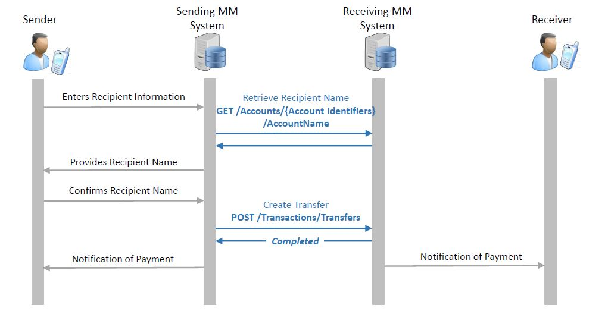
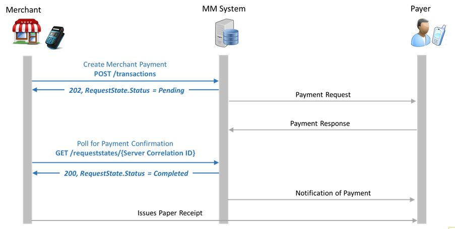

# Comparison between DFSP Over the Top and GSMA Mobile Money APIs

----------

## Document Introduction

This document offers a technical comparison between the Mobile Money API defined by GSMA and DFSP Over the Top API.

The purpose of the harmonized GSMA mobile money API is to support the movement of financial transactions between a mobile money service and a third party, and vice versa. Some other non-transactional use cases are also supported, for example enabling a debit mandate to be applied to an account.

DFSP Over the Top API exposes the DFSP functionalities for transactions processing, customer and account management, etc. to third party applications.

##Use Case Summary

In this document you will find a comparison of the APIs that support the following two use cases:

- Person to Person (P2P) Push Transfer
- Merchant Purchase via Pending Transaction

##API Principles

Both DFSP and GSMA APIs are following the same high level principles:

 - Restful approach to API design
 - Based on JSON; no other content types are supported
 - Object model is abstracted from the underlying object representation
 - Asynchronous operations use a simple state object to support polling and call-back
 - Error Handling: consistent error codes with flexibility to provide specific parameters
 - Security:
	 - Client/Server Authentication via PKI
	 - HTTPs Basic Security Authentication
	 - Only GSMA API supports:
		 - JSON Web Encrtyption (JWE) for the message body
		 - JSON Web Signature (JWS)
		 - OAuth 2.0 to support multiple identity providers
		 

## Person to Person (P2P) Push Transfer

1. GSMA Flow

2. L1P Flow

Comparison between API Methods:

| GSMA MM      | L1P DFSP        | API Method     | Description   |

|:------------|:---------------|:--------------|:--------------|

| Get /Accounts/{Account ID}/AccountName | /UserGet |

The major difference between the two flows is that in the L1P flow there is an additional step which provides all the fees that the customer is going to pay for this transaction. 

## Merchant Purchase via Pending Transaction

1. GSMA Flow

 

2. L1P Flow

The major difference between the two flows is again that in L1P there is a step which provides fee to the payer.

