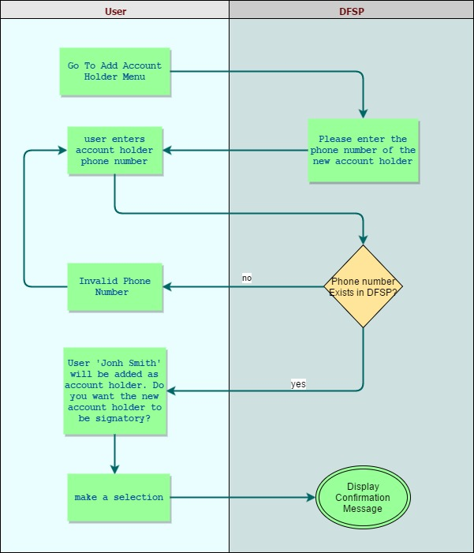

# Manage Account Holders

DFSP system should allow one account to have multiple account holders.

Each account holder, in relation with account could be either signatory or non-signatory.

Signatory account holders will have full rights over the account and can do push transfer, sell good, approve pending transaction, rename account, check balance, check mini-statement operations, add account holders, remove account holders.

Non-signatory account will have the option to check the balance, check mini statement and sell goods.

## Process for Adding an Account Holder

Adding an account holder can be done only by another signatory account holder.

When a new account holder is added to an account the identification of the user will be done via their user number.
If the new account holder's user number is already registered within the DFSP the system will ask whether the new account holder will be a signatory or a non-signatory. The system will add the new account holder and their primary account will not be changed.
In case the new account holder's user number is not registered within the DFSP an error saying that the user number is invalid will be shown.

The business diagram of the process can be seen below:

----

## Process for removing an account holder

An account holder can be removed as such only by a signatory account holder for the same account.
Removing an account holder will just remove the link between the account and the user and will not change the account itself (e.g. will not close it).
In case there is only one signatory account holder for a account, it will not be possilbe to be removed.

The account holders will be presented in the USSD menu by their name.

Removing the account holder process will happen by simply selecting an account holder that has to be removed and confirm the operation via PIN.

In case that the account holder is removed from an account that is a primary for him, the oldest registered account that they have will become a primary one.

In case the account holder which is removed left without accounts, they will see only the menu 'manage accounts' and will be able to create own account.

## Process for viewing the account holders

All the account holders should be available from 'account information' page. The signatory account holders should be marked there as well.

## Process for changing the default DFSP

Each user in the system has a default DFSP. The default DFSP is kept in the central directory and is used when somebody sends money to a user, identified by a user number, the system to determine to which DFSP the money should be send to.

As a security measure the default DFSP could be changed only from the default DFSP for the user.

The process for changing the default DFSP will start by displaying all available DFSPs that the user has accounts registered in. The user could select a DFSP that they would like to be a default one and confirm the operation via PIN. The DFSP will update the central directory with this change.

-------

The [following](./ChangesInTheCentralDirectory.md) changes in the central directory will be required.

