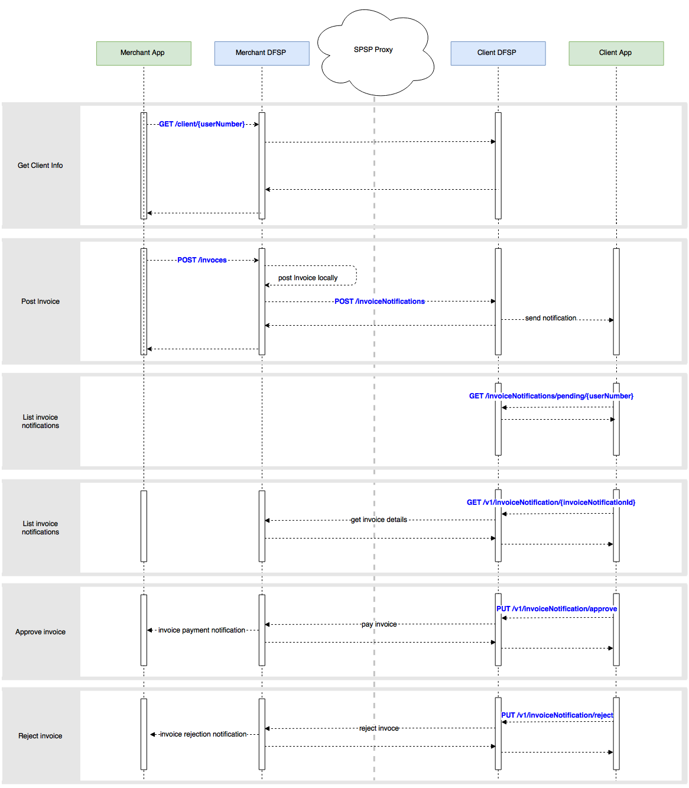

## I.  OVERVIEW  ##

Summary



Assumptions

## II.  GET CLIENT INFORMATION  ##

Summary

### Api description


----
  

* **URL**

  `v1/invoices/client/{userNumber}`

* **Method:**

  `GET`

*  **URL Params**
   * `userNumber - The number of the user`

* **Sample Call:**

  ```
    curl -X GET --header 'Accept: application/json' 'http://host/v1/client/78956562'
  ```

* **Success Response:**

  * **Code:** 200 <br />
    **Content:**  

     * `firstName [string] - Client's first name`  
     * `lastName [string] - Client's last name`  
     * `imageUrl [string] - Link to the client's image`
      
* **Sample Response:**

  ```
    {
      "firstName": "Bob",
      "lastName": "Smith",
      "imageUrl": "https://red.ilpdemo.org/api/receivers/bob/profile_pic.jpg"
    }
  ```


## III.  CREATE INVOICE  ##

Summary

### Api description


----
  

* **URL**

  `v1/invoices`

* **Method:**

  `POST`

* **Data Params**

  **Required:**  

   * `account [string] - Invoice issuer's account`  
   * `amount [number] - Invoice amount`  
   * `userNumber [string] - Client's user number`

   **Optional:**

   * `info [string] - Additional invoice information`

* **Sample Call:**

  ```
    curl -X POST --header 'Content-Type: application/json' --header 'Accept: application/json' -d 
    '{
      "account": "merchant",
      "amount": 123,
      "userNumber": "78956562",
      "info": "Invoice from merchant to Alice"
    }' 
    'http://host/v1/invoices'
  ```

* **Success Response:**

  * **Code:** 200 <br />
    **Content:**
       * `type [string] - Invoice type`
       * `invoiceNotificationId [number] - Invoice notification id`
       * `account [string] - Invoice issuer's account`  
       * `name [string] - Invoice issuer's name`
       * `currencyCode [string] - Invoice issuer's currency code`
       * `currencySymbol [string] - Invoice issuer's currency symbol`
       * `amount [string] - Invoice amount`
       * `status [string] - Invoice status`
       * `userNumber [string] - Invoice recepient's user number`
       * `info [string] - Invoice additional information`

* **Sample Response:**

  ```
    {
      "type": "INVOICE",
      "invoiceNotificationId": 1,
      "account": "merchant",
      "name": "merchant",
      "currencyCode": "USD",
      "currencySymbol": "$",
      "amount": "130.34",
      "status": "pending",
      "userNumber": "78956562",
      "info": "Invoice from merchant for 130.34 USD"
    }
  ```

## IV.  LIST PENDING INVOICES - CLIENT ##

Summary

### Api description

----
  

* **URL**

  `v1/invoiceNotifications/pending/{userNumber}`

* **Method:**

  `GET`

*  **URL Params**

   * `userNumber - Client's user number`

* **Sample Call:**

  ```
    curl -X GET --header 'Accept: application/json' 'http://host/v1/invoiceNotifications/pending/78956562'
  ```

* **Success Response:**

  * **Code:** 200 <br />
    **Content:**
       * `invoiceNotificationId [number] - Invoice notification id`  
       * `statusid [string] - Invoice notification id`  
       * `statusid [string] - Additional invoice notification information`  

* **Sample Response:**

  ```
    {
      "invoices": [
        {
          "invoiceNotificationId": 2,
          "status": "pending",
          "info": "Invoice from merchant for 130.34 USD"
        }
      ]
    }
  ```

## V.  GET INVOICE DETAILS  ##

Summary

### Api description

----
  

* **URL**

  `v1/invoicesNotifications/{invoiceNotificationId}`

* **Method:**

  `GET`

*  **URL Params**

   * `invoiceNotificationId - Invoice notification id`

* **Sample Call:**

  ```
    curl -X GET --header 'Accept: application/json' 'http://host/v1/invoiceNotifications/2'
  ```

* **Success Response:**

  * **Code:** 200 <br />
    **Content:**
       * `firstName [string] - Invoice issuer's first name`  
       * `lastName [string] - Invoice issuer's last name`  
       * `amount [number] - Invoice amount`  
       * `currencyCode [string] - Currency code`  
       * `currencySymbol [string] - Currency symbol`  
       * `fee [number] - Invoice fee`  

* **Sample Response:**

  ```
    {
      "firstName": "Ben",
      "lastName": "Smith",
      "amount": 123,
      "currencyCode": "USD",
      "currencySymbol": "$",
      "fee": 1.23,
    }
  ```

## VI.  APPROVE INVOICE  ##

Summary

### Api description

----
  

* **URL**

  `v1/invoiceNotifications/approve`

* **Method:**

  `PUT`

* **Data Params**

  **Required:**

   * `account [string] - Invoice issuer's account number`    
   * `invoiceNotificationid [string] - Invoice notification id`    

* **Sample Call:**

  ```
    curl -X PUT --header 'Content-Type: application/json' --header 'Accept: application/json' -d 
    '{
      "account": "merchant",
      "invoiceNotificationId": "6"
    }' 
    'http://host/v1/invoiceNotifications/approve'
  ```

* **Success Response:**

  * **Code:** 200 <br />
    **Content:**
      * `invoiceNotificationId [string] - Invoice notification id`  
      * `status [string] - Invoice notification status`  

* **Sample Response:**

  ```
    {
      "invoiceNotificationId": "3",
      "status": "approved",
    }
  ```

## VII.  REJECT INVOICE  ##

Summary

### Api description
----
  

* **URL**

  `v1/invoiceNotifications/reject`

* **Method:**

  `PUT`

* **Data Params**

  **Required:**

   * `invoiceNotificationId [string] - Invoice notification id`

* **Sample Call:**

  ```
    curl -X PUT --header 'Content-Type: application/json' --header 'Accept: application/json' -d 
   '{
       "invoiceNotificationId": "2"
    }' 
    'http://host/v1/invoiceNotifications/reject'
  ```

* **Success Response:**

  * **Code:** 200 <br />
    **Content:**
      * `invoiceNotificationId [string] - Invoice notification id`  
      * `status [string] - Invoice notification status`  


* **Sample Response:**

  ```
    {
      "invoiceNotificationId": "2",
      "status": "rejected",
    }
  ```
