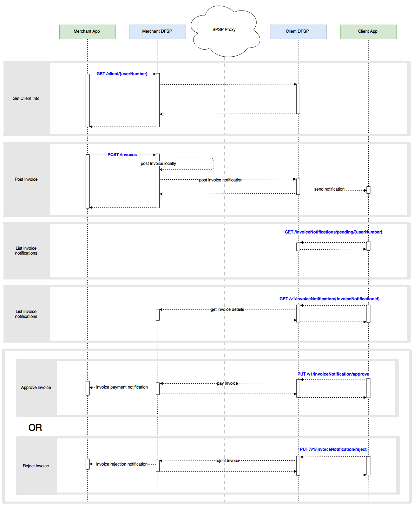

## I.  Overview  ##

Current document will cover the flow of creating and approving/rejecting pending transfers using
DFSP Over the Top API. The API exposes the DFSP functionalities for transfers processing, customer and account management, etc. to third party applications such as Android/IPhone smart application. There are additional set of APIs which are used for communication between DFSP to DFSP. Those APIs will not be analyzed in the current document.

API Principles

  * Restful approach to API design.
  * Based on JSON, no other content types are supported.

  


## II. Assumptions  ##

   * Merchant is the party sending the invoices.
   * Client is the party who is receiving the ivoices and is able to approve/reject them.
   * The merchant and the client are in different systems.
   * The merchant and the client are logged in to their systems.
   * Security is not a part of this specification.
   * Getting information about the customer accounts is not a part of this specification.
   * Notifications are not a part of this specification, as each platform provides different means for that (e.g. google firebase notification services, SMS notification, email notification, etc.).


## III.  Get client information  ##

The back-end will check whether the client is in the same system and if that's the case then it will return the respective information, otherwise it will query the central directory in order to obtain it.

### Api description

----


* **URL**

  `/v1/client/{userNumber}`

* **Method:**

  `GET`

*  **URL Params**
   * `userNumber - The number of the user`

* **Sample Call:**

  ```
    curl -X GET --header 'Accept: application/json' 'http://host/v1/client/78956562'
  ```

* **Success Response:**

  * **Code:** 200 <br />
    **Content:**

     * `firstName [string] - Client's first name`
     * `lastName [string] - Client's last name`
     * `imageUrl [string] - Link to the client's image`

* **Sample Response:**

  ```
    {
      "firstName": "Bob",
      "lastName": "Smith",
      "imageUrl": "https://red.ilpdemo.org/api/receivers/bob?securityKey=497a2af553cc1cc6443692c6eed60ebda1a08020d287c4f5461a1e41d840d6f5"
    }
  ```
* **Error handling:**
  
  * **Code:** 401 <br />
  **Content:**
  ```
    {
      "id": "Unauthorized",
      "message": "Access is denied due to invalid credentials"
    }
  ```  
 
  * **Code:** 404 <br />
  **Content:**
  ```
    {
      "id": "ClientNotFound",
      "message": "Client userNumber could not be found"
    }
  ```

* **<a href="http://ec2-35-163-249-3.us-west-2.compute.amazonaws.com:8010/documentation?tags=getClient" target="_blank">Try it out here</a>**


## IV.  Create invoice  ##

The invoice will be created in the merchant's DFSP. It will be associated with an account. Currency information will be taken from the merchant's account. After the invoice is created in the merchant's DFSP a notification with the invoice reference will be send to the default client DFSP. The invoice reference in the client DFSP will not be associated with any clients account thus the client can choose an account from which they are going to pay the invoice.

### Api description
----


* **URL**

  `/v1/invoices`

* **Method:**

  `POST`

* **Data Params**

  **Required:**

   * `account [string] - Invoice merchant's account`
   * `amount [number] - Invoice amount`
   * `userNumber [string] - Client's user number`

   **Optional:**

   * `info [string] - Additional invoice information`

* **Sample Call:**

  ```
    curl -X POST --header 'Content-Type: application/json' --header 'Accept: application/json' -d
    '{
      "account": "merchant",
      "amount": 123,
      "userNumber": "78956562",
      "info": "Invoice from merchant to Alice"
    }'
    'http://host/v1/invoices'
  ```

* **Success Response:**

  * **Code:** 200 <br />
    **Content:**
       * `invoiceId [number] - Invoice id`
       * `account [string] - Invoice merchant's account`
       * `firstName [string] - Merchant's first name`
       * `lastName [string] - Merchant's last name`
       * `currencyCode [string] - Invoice merchant's currency code`
       * `currencySymbol [string] - Invoice merchant's currency symbol`
       * `amount [string] - Invoice amount`
       * `status [string] - Invoice status`
       * `userNumber [string] - Invoice client's user number`
       * `info [string] - Invoice additional information`  

 * **Note:** Invoice status can be one of the following:
     * approved  
     * pending  
     * rejected  
      
* **Sample Response:**

  ```
    {
      "invoiceId": 1,
      "account": "merchant",
      "firstName": "John",
      "lastName": "Smith",
      "currencyCode": "USD",
      "currencySymbol": "$",
      "amount": "130.34",
      "status": "pending",
      "userNumber": "78956562",
      "info": "Invoice from merchant for 130.34 USD"
    }
  ```
* **Error handling:**
  
  * **Code:** 401 <br />
  **Content:**
  ```
    {
      "id": "Unauthorized",
      "message": "Access is denied due to invalid credentials"
    }
  ```  

  * **Code:** 404 <br />
  **Content:**
  ```
    {
      "id": "ClientNotFound",
      "message": "Client userNumber could not be found"
    }
  ```  

  * **Code:** 404 <br />
  **Content:**
  ```
    {
      "id": "MerchantNotFound",
      "message": "Merchant account could not be found"
    }
  ```  
 
* **<a href="http://ec2-35-163-249-3.us-west-2.compute.amazonaws.com:8010/documentation?tags=postInvoice" target="_blank">Try it out here</a>**


## V.  Pending invoice notifications ##

Client will be able to obtain a list of all the pending invoices associated with him.

### Api description

----


* **URL**

  `/v1/invoiceNotifications/pending/{userNumber}`

* **Method:**

  `GET`

*  **URL Params**

   * `userNumber - Client's user number`

* **Sample Call:**

  ```
    curl -X GET --header 'Accept: application/json' 'http://host/v1/invoiceNotifications/pending/78956562'
  ```

* **Success Response:**

  * **Code:** 200 <br />
    **Content:**
       * `invoiceNotificationId [number] - Invoice notification id`
       * `status [string] - Invoice notification status`
       * `info [string] - Additional invoice notification information`  

* **Note:** Invoice notification status can be one of the following:

     * approved  
     * pending  
     * rejected  

* **Sample Response:**

  ```
    {
      "invoices": [
        {
          "invoiceNotificationId": 2,
          "status": "pending",
          "info": "Invoice from merchant for 130.34 USD"
        }
      ]
    }
  ```  

* **Error handling:**
  
  * **Code:** 401 <br />
  **Content:**
  ```
    {
      "id": "Unauthorized",
      "message": "Access is denied due to invalid credentials"
    }
  ```  

  * **Code:** 404 <br />
  **Content:**
  ```
    {
      "id": "ClientNotFound",
      "message": "Client userNumber could not be found"
    }
  ```  

* **<a href="http://ec2-35-163-249-3.us-west-2.compute.amazonaws.com:8010/documentation?tags=getInvoiceNotificationList" target="_blank">Try it out here</a>**


## VI.  Get payment details by invoiceNotificationId  ##

It will return all the data related to the posted invoice by passing the invoice notification ID.

### Api description

----


* **URL**

  `/v1/invoicesNotifications/{invoiceNotificationId}`

* **Method:**

  `GET`

*  **URL Params**

   * `invoiceNotificationId - Invoice notification id`

* **Sample Call:**

  ```
    curl -X GET --header 'Accept: application/json' 'http://host/v1/invoiceNotifications/2'
  ```

* **Success Response:**

  * **Code:** 200 <br />
    **Content:**
       * `firstName [string] - Merchant's first name`
       * `lastName [string] - Merchant's last name`
       * `amount [number] - Invoice amount`
       * `currencyCode [string] - Currency code`
       * `currencySymbol [string] - Currency symbol`
       * `fee [number] - Transfer fee`

* **Sample Response:**

  ```
    {
      "firstName": "Ben",
      "lastName": "Smith",
      "amount": 123,
      "currencyCode": "USD",
      "currencySymbol": "$",
      "fee": 1.23,
    }
  ```

* **Error handling:**
  
  * **Code:** 401 <br />
  **Content:**
  ```
    {
      "id": "Unauthorized",
      "message": "Access is denied due to invalid credentials"
    }
  ```  

  * **Code:** 404 <br />
  **Content:**
  ```
    {
      "id": "InvoiceNotificationNotFound",
      "message": "Invoice notification with such invoiceNotificationId could not be found"
    }
  ```  

* **<a href="http://ec2-35-163-249-3.us-west-2.compute.amazonaws.com:8010/documentation?tags=getInvoiceInfo" target="_blank">Try it out here</a>**


## VII.  Pay invoice  ##

Client will be able to approve invoices. With this action invoice notification will be approved, merchant's DFSP will be notified and it will mark merchant's invoice as approved. Once the payment process is finished the merchant will automatically receive invoice payment notification.

### Api description
----

* **URL**

  `/v1/invoiceNotifications/approve`

* **Method:**

  `PUT`

* **Data Params**

  **Required:**

   * `account [string] - Client's account`
   * `invoiceNotificationId [string] - Invoice notification id`

* **Sample Call:**

  ```
    curl -X PUT --header 'Content-Type: application/json' --header 'Accept: application/json' -d
    '{
      "account": "bob",
      "invoiceNotificationId": "6"
    }'
    'http://host/v1/invoiceNotifications/approve'
  ```

* **Success Response:**

  * **Code:** 200 <br />
    **Content:**
      * `invoiceNotificationId [string] - Invoice notification id`
      * `status [string] - Invoice notification status`  
  
* **Note:** Invoice notification status can be one of the following:

     * approved  
     * pending  
     * rejected  

* **Sample Response:**

  ```
    {
      "invoiceNotificationId": "3",
      "status": "approved",
    }
  ```

  * **Error handling:**
  
  * **Code:** 400 <br />
  **Content:**
  ```
    {
      "id": "InvoiceNotificationNotFound",
      "message": "Invoice notification with such invoiceNotificationId could not be found"
    }
  ```  
  * **Code:** 401 <br />
  **Content:**
  ```
    {
      "id": "Unauthorized",
      "message": "Access is denied due to invalid credentials"
    }
  ```  

  * **Code:** 500 <br />
  **Content:**
  ```
    {
      "id": "InsufficientFunds",
      "message": "You do not have sufficient funds to pay the inoice"
    }
  ``` 

* **<a href="http://ec2-35-163-249-3.us-west-2.compute.amazonaws.com:8010/documentation?tags=approveInvoiceNotification" target="_blank">Try it out here</a>**


## VIII.  Reject invoice  ##

Client also will be able to reject invoices. With this action invoice notification will be rejected, merchant's DFSP will be notified and it will reject the merchant's invoice. Once the payment is rejected the merchant will automatically receive invoice rejection notification.

### Api description
----

* **URL**

  `/v1/invoiceNotifications/reject`

* **Method:**

  `PUT`

* **Data Params**

  **Required:**

   * `invoiceNotificationId [string] - Invoice notification id`

* **Sample Call:**

  ```
    curl -X PUT --header 'Content-Type: application/json' --header 'Accept: application/json' -d
   '{
       "invoiceNotificationId": "2"
    }'
    'http://host/v1/invoiceNotifications/reject'
  ```

* **Success Response:**

  * **Code:** 200 <br />
    **Content:**
      * `invoiceNotificationId [string] - Invoice notification id`
      * `status [string] - Invoice notification status`

* **Note:** Invoice notification status can be one of the following:

     * approved  
     * pending  
     * rejected 

* **Sample Response:**

  ```
    {
      "invoiceNotificationId": "2",
      "status": "rejected",
    }
  ```

 * **Error handling:**
  
  * **Code:** 400 <br />
  **Content:**
  ```
    {
      "id": "InvoiceNotificationNotFound",
      "message": "Invoice notification with such invoiceNotificationId could not be found"
    }
  ```  
  * **Code:** 401 <br />
  **Content:**
  ```
    {
      "id": "Unauthorized",
      "message": "Access is denied due to invalid credentials"
    }
  ```  

* **<a href="http://ec2-35-163-249-3.us-west-2.compute.amazonaws.com:8010/documentation?tags=rejectInvoiceNotification" target="_blank">Try it out here</a>**
