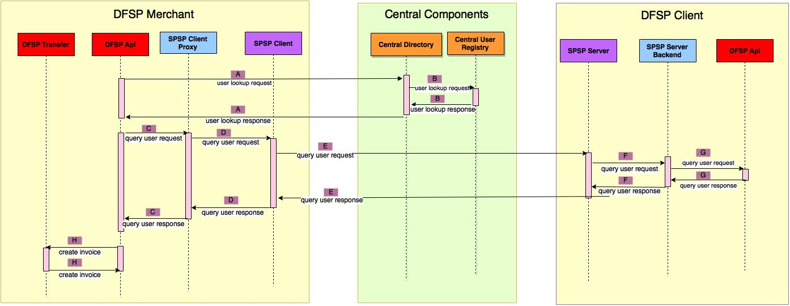

#  Pending Transaction Use Case

#### Assumptions

1. The invoice will be created in the merchant's DFSP. It will be associated with an account.
2. After the invoice is created in the merchant's DFSP a notification with the invoice reference will be send to the default client DFSP.
3. The client DFSP will stored the reference (full URL) to the merchant's invoice.
4. The invoice reference in the client DFSP will not be associated with any clients account thus the client can choose an account from which he is going to pay the invoice.
5. As a consequence of the above, in case the client has accounts in more than one DFSP he will receive the invoice notification only in his default DFSP and from the USSD interface he will be able to pay the invoice only from his default DFSP

I would like to propose the following new APIs and changes to the existing APIs defined to support the pending transaction use case.

In the notes below I will refer to '**dfsp1**' as client DFSP (paying the invoice) and '**dfsp2**' as the merchant DFSP (issuing the invoice)

## I. LOOKUP  RECEIVER ##

## I. INVOICE NOTIFICATION CREATION  ##

###  [ SPSP CLIENT Proxy / SPSP Client](https://github.com/LevelOneProject/ilp-spsp-client-rest) ###

We have to create a new API to in SPSP Client to support the invoice creation.

**(1.1)Create Invoice Notification Method**

*Request:*

	POST http://dfsp2.spsp-client/invoice/
	{
  		"invoiceId":"12345",
  		"submissionUrl": "dfsp1.spsp-server",
		"senderIdentifier": "client.user.number",
  		"memo":"Bolagi Shop $5.00"
	}

*Response:*

	201 Created

- invoiceId - Id of the invoice that has been generated and stored in the merchant's DFSP.
- submissionUrl - URL to client DFSP. Since this message is send from DFSP-Transfer service to SPSP Client Proxy Service, the receiver service has to know which targer SPSP server to contact. This information should be stored in the central directory and can be mapped from a user number.
- memo - field that is going to be displayed on the USSD menu under the 'pending transaction section

###  [ SPSP SERVER ](https://github.com/LevelOneProject/ilp-spsp-server) ###

**(1.2)Create Invoice Notification Method**

This method will be used for communication between SPSP Client and SPSP Server components

*Request:*

	POST http://dfsp1.spsp-server/receiver/invoice/
	{
  		"invoiceUrl":"http://dfsp2.spsp-server/invoice/12345",
		"senderIdentifier": "client.user.number",
  		"memo":"Bolagi Shop $5.00"
	}

*Response:*

	201 Created

- invoiceUrl - full URL to the invoice which is generated and stored in the merchant's DFSP.
- memo - field that is going to be displayed on the USSD menu under the 'pending transaction section

###  [ SPSP Server Backend / DFSP API ](https://github.com/LevelOneProject/dfsp-api) ###

**(1.3)Create Invoice Notification Method**

This method will be invoked from SPSP Server and will be used to create invoice reference the 'DFSP Logic'.

*Request:*

	POST http://dfsp1.dfsp-api/receiver/invoice/

	{
		"invoiceUrl":"http://dfsp2.spsp-server/invoice/12345",
		"senderIdentifier": "client.user.number",
  		"memo":"Bolagi Shop $5.00"
	}

*Response:*

	201 Created

- invoiceUrl - full URL to the invoice which is generated and stored in the merchant's DFSP.
- memo - field that is going to be displayed on the USSD menu under the 'pending transaction section

## II. GET INVOICE DETAILS   ##

###  [ SPSP CLIENT PROXY / SPSP CLIENT ](https://github.com/LevelOneProject/ilp-spsp-client-rest) ###

**(2.1)Get Invoice Details**

Get Invoice details will be done by using the already defined method [GET /v1/query API](https://github.com/LevelOneProject/ilp-spsp-client-rest/blob/master/README.md#get-v1query)

*Request:*

	GET http://dfsp1.spsp-clinet/invoice?invoiceUrl=http://dfsp2.spsp-server/invoice/12345

*Response:*

	200 OK

	{
	  "account": "dfsp2.bob.dylan.account",
	  "name":"Bob Dylan",
	  "currencyCode": "USD",
	  "currencySymbol": "$",
	  "amount": "10.40",
	  "fee":"2.4",
	  "status": "unpaid",
	  "invoiceInfo": "https://www.example.com/gp/your-account/order-details?ie=UTF8&orderID=111-7777777-1111111"
	}

The following changes will be introduced:

- Add the invoiceUrl as request parameter, since this API is used between DFSP-Transfer and SPSP Client component. After that the SPSP client component has to have the URL to the merchant DFSP where the invoice is stored.
- type field is removed. No need of such field, because the request is for invoice.
- Add the field 'name' - this is the name of the merchant that has issued the invoice.

###  [ SPSP SERVER ](https://github.com/LevelOneProject/ilp-spsp-server) ###

**(2.2)Get Invoice Details**

Get Invoice details in SPSP server will be done by using the already defined method [GET invoice](https://github.com/LevelOneProject/ilp-spsp-server/blob/master/README.md#invoice)

*Request:*

	GET http://dfsp2.spsp-server/invoice/12345

*Response:*

	200 OK

	{
	  "account": "dfsp2.bob.dylan.account",
	  "name":"Bob Dylan",
	  "currencyCode": "USD",
	  "currencySymbol": "$",
	  "amount": "10.40",
	  "status": "unpaid",
	  "invoiceInfo": "https://merchant-website.example/gp/your-account/order-details?ie=UTF8&orderID=111-7777777-1111111"
	}

The following changes will be introduced:

- type field is removed. No need of such field, because the request is for invoice.
- Add the field 'name' - this is the name of the merchant that has issued the invoice.
- Remove field paymentURL - we already have an account field

###  [ SPSP Server Backend / DFSP API ](https://github.com/LevelOneProject/dfsp-api) ###

**(2.3)Get Invoice Details**

The following new method will be implemented in DFSP API. SPSP Server will call this new method to obtain information about an invoice from the 'DFSP Logic'.

*Request:*

	GET http://dfsp2.dfsp-api/invoice/12345

*Response:*

	200 OK

	{
	  "account": "dfsp2.bob_dylan.account",
	  "name":"Bob Dylan",
	  "currencyCode": "USD",
	  "currencySymbol": "$",
	  "amount": "10.40",
	  "status": "unpaid",
	  "invoiceInfo": "https://merchant-website.example/gp/your-account/order-details?ie=UTF8&orderID=111-7777777-1111111"
	}

## PREPARE PAYMENT ##

###  [ SPSP CLIENT PROXY / SPSP CLIENT ](https://github.com/LevelOneProject/ilp-spsp-client-rest) ###

**(3.1)Prepare Payment**

For prepare payment, an already existing API from SPSP Client will be used. [POST /v1/setup](https://github.com/LevelOneProject/ilp-spsp-client-rest#post-v1setup)

*Request:*

	POST http://dfsp1.spsp-client/v1/setup

	{
  		"receiver": "http://dfsp2.spsp-server/invoice/12345",
  		"sourceAccount": "dfsp1.alice.account",
  		"sourceIdentifier": "9809890190934023"
	}

*Response:*

	201 Created

	{
		"id": "b9c4ceba-51e4-4a80-b1a7-2972383e98af",
		"name":"Bob Dilan",
		"destinationAccount": "dfsp2.bob_dylan.account",
	  	"destinationAmount": "10.40",
	  	"sourceAmount": "9.00",
	  	"sourceAccount": "dfsp1.alice.account",
	  	"expiresAt": "2016-08-16T12:00:00Z",
	  	"data": {
		    "senderIdentifier": "9809890190934023"
	  	},
	  	"additionalHeaders": "asdf98zxcvlknannasdpfi09qwoijasdfk09xcv009as7zxcv",
	  	"execution_condition": "cc:0:3:wey2IMPk-3MsBpbOcObIbtgIMs0f7uBMGwebg1qUeyw:32",
	  	"cancelation_condition": "dd:0:5:eey2IMPk-3MsBpbOcObIbtgIMs0f7uBMGwebg1qUeyw:32"
	}

The following changes will be introduced:

- Rename 'address' to destinationAccount for consistency
- Add name field which will contain the name of the merchant.
- Include cancelation_condition - we need that to be able to cancel the transaction in case the amount or the fee does not satisfy the client
- Rename condition to execution_condition

###  [ SPSP SERVER ](https://github.com/LevelOneProject/ilp-spsp-server) ###

**(3.2)Prepare Payment**

For prepare payment, an already existing API from SPSP Server will be used. [PUT invoice](https://github.com/LevelOneProject/ilp-spsp-server/blob/master/README.md#invoice-1)

*Request:*

	PUT http://dfsp2.spsp-server/invoice/12345

*Response:*

	200 OK

	{
  		"senderIdentifier": "9809890190934023",
  		"status": "proposed"
	}

###  [ SPSP SERVER BACKEND / DFSP API ](https://github.com/LevelOneProject/dfsp-api) ###

We don't need a notification about the proposed state in SPSP Server backedn and DFSP Logic.

## EXECUTE PAYMENT ##

###  [ SPSP CLIENT ](https://github.com/LevelOneProject/ilp-spsp-client-rest) ###

**(4.1) Execute Payment**

Use an exiting method:

PUT /v1/payments/:id

###  [ SPSP SERVER ](https://github.com/LevelOneProject/ilp-spsp-server) ###

**(4.2) Execute Payment**

User an existing method:

PUT /v1/payments/:id

###  [ SPSP SERVER BACKEND / DFSP API ](https://github.com/LevelOneProject/dfsp-api) ###

**(4.3) Execute Payment**

A new method will be introduce for SPSP Server to call DFSP API

*Request:*

	PUT http://dfsp2.spsp-server/invoice/12345

*Response:*

	200 OK

	{
		"senderIdentifier": "9809890190934023",
  		"status": "executed"
	}
