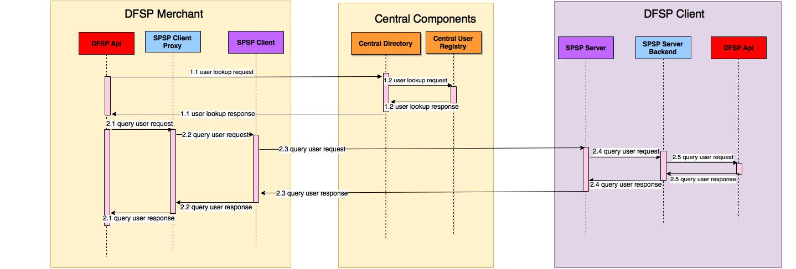
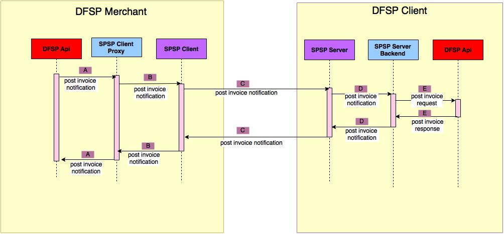
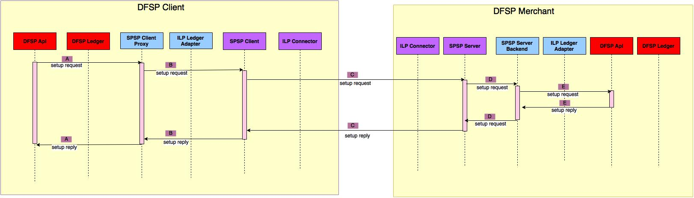
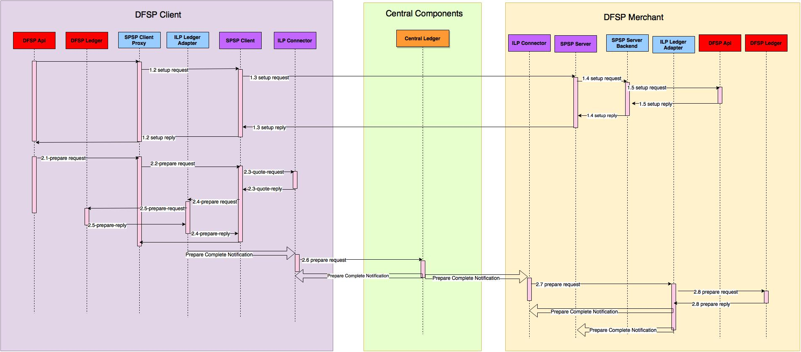
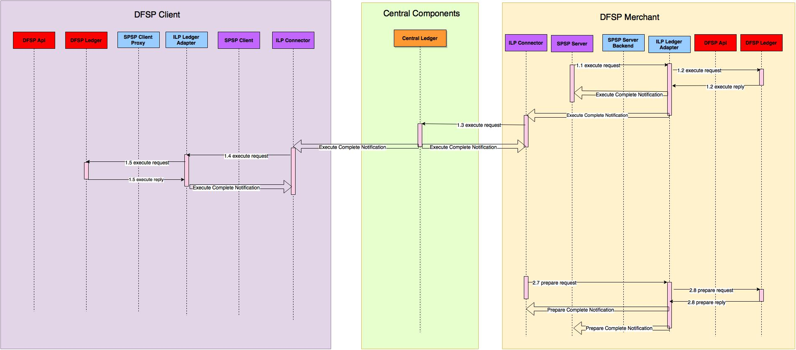
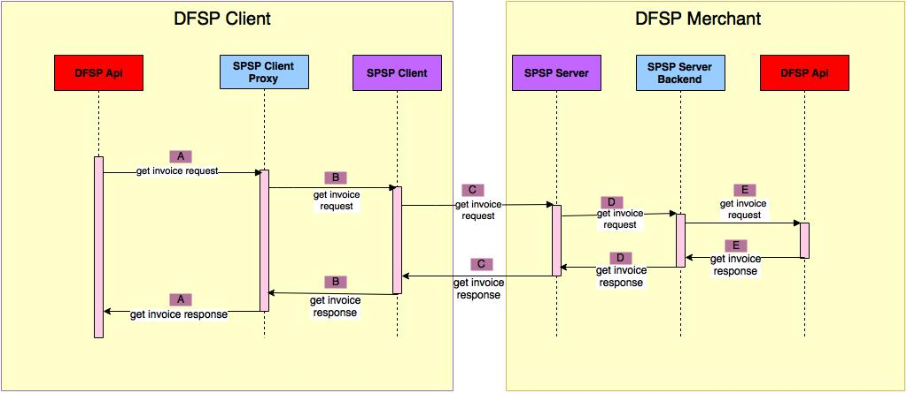

#  Pending Transaction Use Case

#### Assumptions

1. The invoice will be created in the merchant's DFSP. It will be associated with an account.
2. After the invoice is created in the merchant's DFSP a notification with the invoice reference will be send to the default client DFSP.
3. The client DFSP will stored the reference (full URL) to the merchant's invoice.
4. The invoice reference in the client DFSP will not be associated with any clients account thus the client can choose an account from which he is going to pay the invoice.
5. As a consequence of the above, in case the client has accounts in more than one DFSP he will receive the invoice notification only in his default DFSP and from the USSD interface he will be able to pay the invoice only from his default DFSP

I would like to propose the following new APIs and changes to the existing APIs defined to support the pending transaction use case.

In the notes below I will refer to '**dfsp1**' as client DFSP (paying the invoice) and '**dfsp2**' as the merchant DFSP (issuing the invoice)

## I. LOOKUP  RECEIVER ##

      
####  A. User Lookup Request from [ DFSP API ](https://github.com/LevelOneProject/dfsp-api) to [ Central Directory ](https://github.com/LevelOneProject/central-directory) ###

**Endpoint**

DFSP API calls [GET /user] endpoint in Central Directory

*Request:*

	POST http://dfsp1.spsp-client/v1/setup

	{
  		"receiver": "http://dfsp2.spsp-server/invoice/12345",
  		"sourceAccount": "dfsp1.alice.account",
  		"sourceIdentifier": "9809890190934023"
	}

*Response:*

	201 Created

	{
		"id": "b9c4ceba-51e4-4a80-b1a7-2972383e98af",
		"name":"Bob Dilan",
		"destinationAccount": "dfsp2.bob_dylan.account",
	  	"destinationAmount": "10.40",
	  	"sourceAmount": "9.00",
	  	"sourceAccount": "dfsp1.alice.account",
	  	"expiresAt": "2016-08-16T12:00:00Z",
	  	"data": {
		    "senderIdentifier": "9809890190934023"
	  	},
	  	"additionalHeaders": "asdf98zxcvlknannasdpfi09qwoijasdfk09xcv009as7zxcv",
	  	"execution_condition": "cc:0:3:wey2IMPk-3MsBpbOcObIbtgIMs0f7uBMGwebg1qUeyw:32",
	  	"cancelation_condition": "dd:0:5:eey2IMPk-3MsBpbOcObIbtgIMs0f7uBMGwebg1qUeyw:32"
	}

####  B. User Lookup Request from  [ Central Directory ](https://github.com/LevelOneProject/central-directory) to [ Central Registry ](https://github.com/LevelOneProject/central-end-user-registry)###

**Endpoint**

Central Directory [GET /user] endpoint in Central End User Registry

*Request:*

	POST http://dfsp1.spsp-client/v1/setup

	{
  		"receiver": "http://dfsp2.spsp-server/invoice/12345",
  		"sourceAccount": "dfsp1.alice.account",
  		"sourceIdentifier": "9809890190934023"
	}

*Response:*

	201 Created

	{
		"id": "b9c4ceba-51e4-4a80-b1a7-2972383e98af",
		"name":"Bob Dilan",
		"destinationAccount": "dfsp2.bob_dylan.account",
	  	"destinationAmount": "10.40",
	  	"sourceAmount": "9.00",
	  	"sourceAccount": "dfsp1.alice.account",
	  	"expiresAt": "2016-08-16T12:00:00Z",
	  	"data": {
		    "senderIdentifier": "9809890190934023"
	  	},
	  	"additionalHeaders": "asdf98zxcvlknannasdpfi09qwoijasdfk09xcv009as7zxcv",
	  	"execution_condition": "cc:0:3:wey2IMPk-3MsBpbOcObIbtgIMs0f7uBMGwebg1qUeyw:32",
	  	"cancelation_condition": "dd:0:5:eey2IMPk-3MsBpbOcObIbtgIMs0f7uBMGwebg1qUeyw:32"
	}

####  C. Query Receiver Request from  [ DFSP API ](https://github.com/LevelOneProject/dfsp-api) to [ SPSP CLIENT PROXY ](https://github.com/LevelOneProject/interop-spsp-client-proxy) ###

**Endpoint**

DFSP API calls [GET /query] endpoint in SPSP Client Proxy

*Request:*

	POST http://dfsp1.spsp-client/v1/setup

	{
  		"receiver": "http://dfsp2.spsp-server/invoice/12345",
  		"sourceAccount": "dfsp1.alice.account",
  		"sourceIdentifier": "9809890190934023"
	}

*Response:*

	201 Created

	{
		"id": "b9c4ceba-51e4-4a80-b1a7-2972383e98af",
		"name":"Bob Dilan",
		"destinationAccount": "dfsp2.bob_dylan.account",
	  	"destinationAmount": "10.40",
	  	"sourceAmount": "9.00",
	  	"sourceAccount": "dfsp1.alice.account",
	  	"expiresAt": "2016-08-16T12:00:00Z",
	  	"data": {
		    "senderIdentifier": "9809890190934023"
	  	},
	  	"additionalHeaders": "asdf98zxcvlknannasdpfi09qwoijasdfk09xcv009as7zxcv",
	  	"execution_condition": "cc:0:3:wey2IMPk-3MsBpbOcObIbtgIMs0f7uBMGwebg1qUeyw:32",
	  	"cancelation_condition": "dd:0:5:eey2IMPk-3MsBpbOcObIbtgIMs0f7uBMGwebg1qUeyw:32"
	}

####  D. Query Receiver Request from  [ SPSP CLIENT PROXY ](https://github.com/LevelOneProject/interop-spsp-client-proxy) to [ SPSP CLIENT ](https://github.com/LevelOneProject/ilp-spsp-client-rest) ###

**Endpoint**

SPSP Client Proxy calls [GET /query] endpoint in SPSP Client

*Request:*

	POST http://dfsp1.spsp-client/v1/setup

	{
  		"receiver": "http://dfsp2.spsp-server/invoice/12345",
  		"sourceAccount": "dfsp1.alice.account",
  		"sourceIdentifier": "9809890190934023"
	}

*Response:*

	201 Created

	{
		"id": "b9c4ceba-51e4-4a80-b1a7-2972383e98af",
		"name":"Bob Dilan",
		"destinationAccount": "dfsp2.bob_dylan.account",
	  	"destinationAmount": "10.40",
	  	"sourceAmount": "9.00",
	  	"sourceAccount": "dfsp1.alice.account",
	  	"expiresAt": "2016-08-16T12:00:00Z",
	  	"data": {
		    "senderIdentifier": "9809890190934023"
	  	},
	  	"additionalHeaders": "asdf98zxcvlknannasdpfi09qwoijasdfk09xcv009as7zxcv",
	  	"execution_condition": "cc:0:3:wey2IMPk-3MsBpbOcObIbtgIMs0f7uBMGwebg1qUeyw:32",
	  	"cancelation_condition": "dd:0:5:eey2IMPk-3MsBpbOcObIbtgIMs0f7uBMGwebg1qUeyw:32"
	}

####  E. Query Receiver Request from  [ SPSP CLIENT ](https://github.com/LevelOneProject/ilp-spsp-client-rest) to [ SPSP SERVER ](https://github.com/LevelOneProject/ilp-spsp-server) ###

**Endpoint**

SPSP Client calls [GET /query] endpoint in SPSP Server

*Request:*

	POST http://dfsp1.spsp-client/v1/setup

	{
  		"receiver": "http://dfsp2.spsp-server/invoice/12345",
  		"sourceAccount": "dfsp1.alice.account",
  		"sourceIdentifier": "9809890190934023"
	}

*Response:*

	201 Created

	{
		"id": "b9c4ceba-51e4-4a80-b1a7-2972383e98af",
		"name":"Bob Dilan",
		"destinationAccount": "dfsp2.bob_dylan.account",
	  	"destinationAmount": "10.40",
	  	"sourceAmount": "9.00",
	  	"sourceAccount": "dfsp1.alice.account",
	  	"expiresAt": "2016-08-16T12:00:00Z",
	  	"data": {
		    "senderIdentifier": "9809890190934023"
	  	},
	  	"additionalHeaders": "asdf98zxcvlknannasdpfi09qwoijasdfk09xcv009as7zxcv",
	  	"execution_condition": "cc:0:3:wey2IMPk-3MsBpbOcObIbtgIMs0f7uBMGwebg1qUeyw:32",
	  	"cancelation_condition": "dd:0:5:eey2IMPk-3MsBpbOcObIbtgIMs0f7uBMGwebg1qUeyw:32"
	}

####  F. Query Receiver Request from  [ SPSP SERVER ](https://github.com/LevelOneProject/ilp-spsp-server) to [ SPSP Server Backend ](https://github.com/LevelOneProject/interop-spsp-server-backend)###

**Endpoint**

SPSP Server calls [GET /query] endpoint in SPSP Server Backend

*Request:*

	POST http://dfsp1.spsp-client/v1/setup

	{
  		"receiver": "http://dfsp2.spsp-server/invoice/12345",
  		"sourceAccount": "dfsp1.alice.account",
  		"sourceIdentifier": "9809890190934023"
	}

*Response:*

	201 Created

	{
		"id": "b9c4ceba-51e4-4a80-b1a7-2972383e98af",
		"name":"Bob Dilan",
		"destinationAccount": "dfsp2.bob_dylan.account",
	  	"destinationAmount": "10.40",
	  	"sourceAmount": "9.00",
	  	"sourceAccount": "dfsp1.alice.account",
	  	"expiresAt": "2016-08-16T12:00:00Z",
	  	"data": {
		    "senderIdentifier": "9809890190934023"
	  	},
	  	"additionalHeaders": "asdf98zxcvlknannasdpfi09qwoijasdfk09xcv009as7zxcv",
	  	"execution_condition": "cc:0:3:wey2IMPk-3MsBpbOcObIbtgIMs0f7uBMGwebg1qUeyw:32",
	  	"cancelation_condition": "dd:0:5:eey2IMPk-3MsBpbOcObIbtgIMs0f7uBMGwebg1qUeyw:32"
	}

####  G. Query Receiver Request from  [ SPSP Server Backend ](https://github.com/LevelOneProject/interop-spsp-server-backend) to [ DFSP API ](https://github.com/LevelOneProject/dfsp-api)###

**Endpoint**

SPSP Server Backend calls [GET /query] endpoint in DFSP API

*Request:*

	POST http://dfsp1.spsp-client/v1/setup

	{
  		"receiver": "http://dfsp2.spsp-server/invoice/12345",
  		"sourceAccount": "dfsp1.alice.account",
  		"sourceIdentifier": "9809890190934023"
	}

*Response:*

	201 Created

	{
		"id": "b9c4ceba-51e4-4a80-b1a7-2972383e98af",
		"name":"Bob Dilan",
		"destinationAccount": "dfsp2.bob_dylan.account",
	  	"destinationAmount": "10.40",
	  	"sourceAmount": "9.00",
	  	"sourceAccount": "dfsp1.alice.account",
	  	"expiresAt": "2016-08-16T12:00:00Z",
	  	"data": {
		    "senderIdentifier": "9809890190934023"
	  	},
	  	"additionalHeaders": "asdf98zxcvlknannasdpfi09qwoijasdfk09xcv009as7zxcv",
	  	"execution_condition": "cc:0:3:wey2IMPk-3MsBpbOcObIbtgIMs0f7uBMGwebg1qUeyw:32",
	  	"cancelation_condition": "dd:0:5:eey2IMPk-3MsBpbOcObIbtgIMs0f7uBMGwebg1qUeyw:32"
	}

## II. CREATE INVOICE  ##

TO BE FILLED BY SG

## III. POST INVOICE NOTIFICATION  ##

####  A. Post Invoice Notification from [ DFSP API ](https://github.com/LevelOneProject/dfsp-api) to [ SPSP CLIENT PROXY ](https://github.com/LevelOneProject/interop-spsp-client-proxy) ###

**Endpoint**

DFSP API calls [POST /v1/invoices] endpoint in SPSP Client Proxy

*Request:*

	POST http://dfsp1.spsp-client/v1/setup

	{
  		"receiver": "http://dfsp2.spsp-server/invoice/12345",
  		"sourceAccount": "dfsp1.alice.account",
  		"sourceIdentifier": "9809890190934023"
	}

*Response:*

	201 Created

	{
		"id": "b9c4ceba-51e4-4a80-b1a7-2972383e98af",
		"name":"Bob Dilan",
		"destinationAccount": "dfsp2.bob_dylan.account",
	  	"destinationAmount": "10.40",
	  	"sourceAmount": "9.00",
	  	"sourceAccount": "dfsp1.alice.account",
	  	"expiresAt": "2016-08-16T12:00:00Z",
	  	"data": {
		    "senderIdentifier": "9809890190934023"
	  	},
	  	"additionalHeaders": "asdf98zxcvlknannasdpfi09qwoijasdfk09xcv009as7zxcv",
	  	"execution_condition": "cc:0:3:wey2IMPk-3MsBpbOcObIbtgIMs0f7uBMGwebg1qUeyw:32",
	  	"cancelation_condition": "dd:0:5:eey2IMPk-3MsBpbOcObIbtgIMs0f7uBMGwebg1qUeyw:32"
	}

####  B. Post Invoice Notification from [ SPSP CLIENT PROXY ](https://github.com/LevelOneProject/interop-spsp-client-proxy) to [ SPSP CLIENT ](https://github.com/LevelOneProject/ilp-spsp-client-rest) ###

**Endpoint**

SPSP Client Proxy calls [POST /v1/invoices] endpoint in SPSP Client

*Request:*

	POST http://dfsp1.spsp-client/v1/setup

	{
  		"receiver": "http://dfsp2.spsp-server/invoice/12345",
  		"sourceAccount": "dfsp1.alice.account",
  		"sourceIdentifier": "9809890190934023"
	}

*Response:*

	201 Created

	{
		"id": "b9c4ceba-51e4-4a80-b1a7-2972383e98af",
		"name":"Bob Dilan",
		"destinationAccount": "dfsp2.bob_dylan.account",
	  	"destinationAmount": "10.40",
	  	"sourceAmount": "9.00",
	  	"sourceAccount": "dfsp1.alice.account",
	  	"expiresAt": "2016-08-16T12:00:00Z",
	  	"data": {
		    "senderIdentifier": "9809890190934023"
	  	},
	  	"additionalHeaders": "asdf98zxcvlknannasdpfi09qwoijasdfk09xcv009as7zxcv",
	  	"execution_condition": "cc:0:3:wey2IMPk-3MsBpbOcObIbtgIMs0f7uBMGwebg1qUeyw:32",
	  	"cancelation_condition": "dd:0:5:eey2IMPk-3MsBpbOcObIbtgIMs0f7uBMGwebg1qUeyw:32"
	}

####  C. Post Invoice Notification from  [ SPSP CLIENT ](https://github.com/LevelOneProject/ilp-spsp-client-rest) to [ SPSP Server ](https://github.com/LevelOneProject/ilp-spsp-server) ###

**Endpoint**

SPSP Client calls [POST /v1/invoices] endpoint in SPSP Server

*Request:*

	POST http://dfsp1.spsp-client/v1/setup

	{
  		"receiver": "http://dfsp2.spsp-server/invoice/12345",
  		"sourceAccount": "dfsp1.alice.account",
  		"sourceIdentifier": "9809890190934023"
	}

*Response:*

	201 Created

	{
		"id": "b9c4ceba-51e4-4a80-b1a7-2972383e98af",
		"name":"Bob Dilan",
		"destinationAccount": "dfsp2.bob_dylan.account",
	  	"destinationAmount": "10.40",
	  	"sourceAmount": "9.00",
	  	"sourceAccount": "dfsp1.alice.account",
	  	"expiresAt": "2016-08-16T12:00:00Z",
	  	"data": {
		    "senderIdentifier": "9809890190934023"
	  	},
	  	"additionalHeaders": "asdf98zxcvlknannasdpfi09qwoijasdfk09xcv009as7zxcv",
	  	"execution_condition": "cc:0:3:wey2IMPk-3MsBpbOcObIbtgIMs0f7uBMGwebg1qUeyw:32",
	  	"cancelation_condition": "dd:0:5:eey2IMPk-3MsBpbOcObIbtgIMs0f7uBMGwebg1qUeyw:32"
	}

####  D. Post Invoice Notification from  [ SPSP Server ](https://github.com/LevelOneProject/ilp-spsp-server) to [ SPSP Server Backend ](https://github.com/LevelOneProject/interop-spsp-server-backend)###

**Endpoint**

SPSP Server calls [POST /v1/invoices] endpoint in SPSP Server Backend

*Request:*

	POST http://dfsp1.spsp-client/v1/setup

	{
  		"receiver": "http://dfsp2.spsp-server/invoice/12345",
  		"sourceAccount": "dfsp1.alice.account",
  		"sourceIdentifier": "9809890190934023"
	}

*Response:*

	201 Created

	{
		"id": "b9c4ceba-51e4-4a80-b1a7-2972383e98af",
		"name":"Bob Dilan",
		"destinationAccount": "dfsp2.bob_dylan.account",
	  	"destinationAmount": "10.40",
	  	"sourceAmount": "9.00",
	  	"sourceAccount": "dfsp1.alice.account",
	  	"expiresAt": "2016-08-16T12:00:00Z",
	  	"data": {
		    "senderIdentifier": "9809890190934023"
	  	},
	  	"additionalHeaders": "asdf98zxcvlknannasdpfi09qwoijasdfk09xcv009as7zxcv",
	  	"execution_condition": "cc:0:3:wey2IMPk-3MsBpbOcObIbtgIMs0f7uBMGwebg1qUeyw:32",
	  	"cancelation_condition": "dd:0:5:eey2IMPk-3MsBpbOcObIbtgIMs0f7uBMGwebg1qUeyw:32"
	}

####  E. Post Invoice Notification from  [ SPSP Server Backend ](https://github.com/LevelOneProject/interop-spsp-server-backend)  to [DFSP API](https://github.com/LevelOneProject/dfsp-api) ###

**Endpoint**

SPSP Server Backend calls [POST /v1/invoices] endpoint in DFSP API

*Request:*

	POST http://dfsp1.spsp-client/v1/setup

	{
  		"receiver": "http://dfsp2.spsp-server/invoice/12345",
  		"sourceAccount": "dfsp1.alice.account",
  		"sourceIdentifier": "9809890190934023"
	}

*Response:*

	201 Created

	{
		"id": "b9c4ceba-51e4-4a80-b1a7-2972383e98af",
		"name":"Bob Dilan",
		"destinationAccount": "dfsp2.bob_dylan.account",
	  	"destinationAmount": "10.40",
	  	"sourceAmount": "9.00",
	  	"sourceAccount": "dfsp1.alice.account",
	  	"expiresAt": "2016-08-16T12:00:00Z",
	  	"data": {
		    "senderIdentifier": "9809890190934023"
	  	},
	  	"additionalHeaders": "asdf98zxcvlknannasdpfi09qwoijasdfk09xcv009as7zxcv",
	  	"execution_condition": "cc:0:3:wey2IMPk-3MsBpbOcObIbtgIMs0f7uBMGwebg1qUeyw:32",
	  	"cancelation_condition": "dd:0:5:eey2IMPk-3MsBpbOcObIbtgIMs0f7uBMGwebg1qUeyw:32"
	}

## IV. SETUP PAYMENT ##

###  A. setup request from [ DFSP API ](https://github.com/LevelOneProject/dfsp-api) to [ SPSP CLIENT PROXY ](https://github.com/LevelOneProject/interop-spsp-client-proxy) ###

**Endpoint**

DFSP API calls [POST /v1/setup](https://github.com/LevelOneProject/ilp-spsp-client-rest#post-v1setup) endpoint in SPSP Client Proxy

*Request:*

	POST http://dfsp1.spsp-client/v1/setup

	{
  		"receiver": "http://dfsp2.spsp-server/invoice/12345",
  		"sourceAccount": "dfsp1.alice.account",
  		"sourceIdentifier": "9809890190934023"
	}

*Response:*

	201 Created

	{
		"id": "b9c4ceba-51e4-4a80-b1a7-2972383e98af",
		"name":"Bob Dilan",
		"destinationAccount": "dfsp2.bob_dylan.account",
	  	"destinationAmount": "10.40",
	  	"sourceAmount": "9.00",
	  	"sourceAccount": "dfsp1.alice.account",
	  	"expiresAt": "2016-08-16T12:00:00Z",
	  	"data": {
		    "senderIdentifier": "9809890190934023"
	  	},
	  	"additionalHeaders": "asdf98zxcvlknannasdpfi09qwoijasdfk09xcv009as7zxcv",
	  	"execution_condition": "cc:0:3:wey2IMPk-3MsBpbOcObIbtgIMs0f7uBMGwebg1qUeyw:32",
	  	"cancelation_condition": "dd:0:5:eey2IMPk-3MsBpbOcObIbtgIMs0f7uBMGwebg1qUeyw:32"
	}

###  B. setup request from [ SPSP CLIENT PROXY ](https://github.com/LevelOneProject/interop-spsp-client-proxy) to [ ILP SPSP CLIENT ](https://github.com/LevelOneProject/ilp-spsp-client-rest)###

**Endpoint**

SPSP Client Proxy calls [POST /v1/setup](https://github.com/LevelOneProject/ilp-spsp-client-rest#post-v1setup) endpoint in ILP SPSP Client

*Request:*

	POST http://dfsp1.spsp-client/v1/setup

	{
  		"receiver": "http://dfsp2.spsp-server/invoice/12345",
  		"sourceAccount": "dfsp1.alice.account",
  		"sourceIdentifier": "9809890190934023"
	}

*Response:*

	201 Created

	{
		"id": "b9c4ceba-51e4-4a80-b1a7-2972383e98af",
		"name":"Bob Dilan",
		"destinationAccount": "dfsp2.bob_dylan.account",
	  	"destinationAmount": "10.40",
	  	"sourceAmount": "9.00",
	  	"sourceAccount": "dfsp1.alice.account",
	  	"expiresAt": "2016-08-16T12:00:00Z",
	  	"data": {
		    "senderIdentifier": "9809890190934023"
	  	},
	  	"additionalHeaders": "asdf98zxcvlknannasdpfi09qwoijasdfk09xcv009as7zxcv",
	  	"execution_condition": "cc:0:3:wey2IMPk-3MsBpbOcObIbtgIMs0f7uBMGwebg1qUeyw:32",
	  	"cancelation_condition": "dd:0:5:eey2IMPk-3MsBpbOcObIbtgIMs0f7uBMGwebg1qUeyw:32"
	}

###  C. setup request from [ ILP SPSP CLIENT ](https://github.com/LevelOneProject/ilp-spsp-client-rest) to [ ILP SPSP SERVER ](https://github.com/LevelOneProject/ilp-spsp-server) on Client side DFSP###

**Endpoint**

ILP SPSP CLIENT calls [POST /v1/setup] endpoint in SPSP Server

*Request:*

	POST http://dfsp1.spsp-client/v1/setup

	{
  		"receiver": "http://dfsp2.spsp-server/invoice/12345",
  		"sourceAccount": "dfsp1.alice.account",
  		"sourceIdentifier": "9809890190934023"
	}

*Response:*

	201 Created

	{
		"id": "b9c4ceba-51e4-4a80-b1a7-2972383e98af",
		"name":"Bob Dilan",
		"destinationAccount": "dfsp2.bob_dylan.account",
	  	"destinationAmount": "10.40",
	  	"sourceAmount": "9.00",
	  	"sourceAccount": "dfsp1.alice.account",
	  	"expiresAt": "2016-08-16T12:00:00Z",
	  	"data": {
		    "senderIdentifier": "9809890190934023"
	  	},
	  	"additionalHeaders": "asdf98zxcvlknannasdpfi09qwoijasdfk09xcv009as7zxcv",
	  	"execution_condition": "cc:0:3:wey2IMPk-3MsBpbOcObIbtgIMs0f7uBMGwebg1qUeyw:32",
	  	"cancelation_condition": "dd:0:5:eey2IMPk-3MsBpbOcObIbtgIMs0f7uBMGwebg1qUeyw:32"
	}

###  D. setup request from [ SPSP SERVER ](https://github.com/LevelOneProject/ilp-spsp-client-server) to [ SPSP SERVER BACKEND ](https://github.com/LevelOneProject/interop-spsp-backend-services)###

**Endpoint**

SPSP SERVER calls [POST /v1/setup] endpoint in SPSP Server Backend

*Request:*

	POST http://dfsp1.spsp-client/v1/setup

	{
  		"receiver": "http://dfsp2.spsp-server/invoice/12345",
  		"sourceAccount": "dfsp1.alice.account",
  		"sourceIdentifier": "9809890190934023"
	}

*Response:*

	201 Created

	{
		"id": "b9c4ceba-51e4-4a80-b1a7-2972383e98af",
		"name":"Bob Dilan",
		"destinationAccount": "dfsp2.bob_dylan.account",
	  	"destinationAmount": "10.40",
	  	"sourceAmount": "9.00",
	  	"sourceAccount": "dfsp1.alice.account",
	  	"expiresAt": "2016-08-16T12:00:00Z",
	  	"data": {
		    "senderIdentifier": "9809890190934023"
	  	},
	  	"additionalHeaders": "asdf98zxcvlknannasdpfi09qwoijasdfk09xcv009as7zxcv",
	  	"execution_condition": "cc:0:3:wey2IMPk-3MsBpbOcObIbtgIMs0f7uBMGwebg1qUeyw:32",
	  	"cancelation_condition": "dd:0:5:eey2IMPk-3MsBpbOcObIbtgIMs0f7uBMGwebg1qUeyw:32"
	}

###  E. setup request from [ SPSP SERVER BACKEND](https://github.com/LevelOneProject/interop-spsp-server-backend) to [ DFSP API ](https://github.com/LevelOneProject/dfsp-api)###

**Endpoint**

SPSP SERVER Backend calls [POST /v1/setup] endpoint in DFSP API

*Request:*

	POST http://dfsp1.spsp-client/v1/setup

	{
  		"receiver": "http://dfsp2.spsp-server/invoice/12345",
  		"sourceAccount": "dfsp1.alice.account",
  		"sourceIdentifier": "9809890190934023"
	}

*Response:*

	201 Created

	{
		"id": "b9c4ceba-51e4-4a80-b1a7-2972383e98af",
		"name":"Bob Dilan",
		"destinationAccount": "dfsp2.bob_dylan.account",
	  	"destinationAmount": "10.40",
	  	"sourceAmount": "9.00",
	  	"sourceAccount": "dfsp1.alice.account",
	  	"expiresAt": "2016-08-16T12:00:00Z",
	  	"data": {
		    "senderIdentifier": "9809890190934023"
	  	},
	  	"additionalHeaders": "asdf98zxcvlknannasdpfi09qwoijasdfk09xcv009as7zxcv",
	  	"execution_condition": "cc:0:3:wey2IMPk-3MsBpbOcObIbtgIMs0f7uBMGwebg1qUeyw:32",
	  	"cancelation_condition": "dd:0:5:eey2IMPk-3MsBpbOcObIbtgIMs0f7uBMGwebg1qUeyw:32"
	}

###  F. setup request from [ SPSP SERVER BACKEND](https://github.com/LevelOneProject/interop-spsp-server-backend) to [ DFSP API ](https://github.com/LevelOneProject/dfsp-api)###

**Endpoint**

SPSP SERVER Backend calls [POST /v1/setup] endpoint in DFSP API

*Request:*

	POST http://dfsp1.spsp-client/v1/setup

	{
  		"receiver": "http://dfsp2.spsp-server/invoice/12345",
  		"sourceAccount": "dfsp1.alice.account",
  		"sourceIdentifier": "9809890190934023"
	}

*Response:*

	201 Created

	{
		"id": "b9c4ceba-51e4-4a80-b1a7-2972383e98af",
		"name":"Bob Dilan",
		"destinationAccount": "dfsp2.bob_dylan.account",
	  	"destinationAmount": "10.40",
	  	"sourceAmount": "9.00",
	  	"sourceAccount": "dfsp1.alice.account",
	  	"expiresAt": "2016-08-16T12:00:00Z",
	  	"data": {
		    "senderIdentifier": "9809890190934023"
	  	},
	  	"additionalHeaders": "asdf98zxcvlknannasdpfi09qwoijasdfk09xcv009as7zxcv",
	  	"execution_condition": "cc:0:3:wey2IMPk-3MsBpbOcObIbtgIMs0f7uBMGwebg1qUeyw:32",
	  	"cancelation_condition": "dd:0:5:eey2IMPk-3MsBpbOcObIbtgIMs0f7uBMGwebg1qUeyw:32"
	}

## IV. PREPARE PAYMENT ##

###  A. Prepare payment request from [ DFSP API ](https://github.com/LevelOneProject/dfsp-api) to [ SPSP CLIENT PROXY ](https://github.com/LevelOneProject/interop-spsp-client-proxy) ###

**Endpoint**

DFSP API calls [POST /v1/transfers/{id}](https://github.com/LevelOneProject/ilp-spsp-client-rest#post-v1setup) endpoint in SPSP Client Proxy

*Request:*

	POST http://dfsp1.spsp-client/v1/setup

	{
  		"receiver": "http://dfsp2.spsp-server/invoice/12345",
  		"sourceAccount": "dfsp1.alice.account",
  		"sourceIdentifier": "9809890190934023"
	}

*Response:*

	201 Created

	{
		"id": "b9c4ceba-51e4-4a80-b1a7-2972383e98af",
		"name":"Bob Dilan",
		"destinationAccount": "dfsp2.bob_dylan.account",
	  	"destinationAmount": "10.40",
	  	"sourceAmount": "9.00",
	  	"sourceAccount": "dfsp1.alice.account",
	  	"expiresAt": "2016-08-16T12:00:00Z",
	  	"data": {
		    "senderIdentifier": "9809890190934023"
	  	},
	  	"additionalHeaders": "asdf98zxcvlknannasdpfi09qwoijasdfk09xcv009as7zxcv",
	  	"execution_condition": "cc:0:3:wey2IMPk-3MsBpbOcObIbtgIMs0f7uBMGwebg1qUeyw:32",
	  	"cancelation_condition": "dd:0:5:eey2IMPk-3MsBpbOcObIbtgIMs0f7uBMGwebg1qUeyw:32"
	}

###  B. Prepare payment request from [ SPSP CLIENT PROXY ](https://github.com/LevelOneProject/interop-spsp-client-proxy) ###

**Endpoint**

DFSP API calls [POST /v1/transfers/{id}](https://github.com/LevelOneProject/ilp-spsp-client-rest#post-v1setup) endpoint in SPSP Client Proxy

*Request:*

	POST http://dfsp1.spsp-client/v1/setup

	{
  		"receiver": "http://dfsp2.spsp-server/invoice/12345",
  		"sourceAccount": "dfsp1.alice.account",
  		"sourceIdentifier": "9809890190934023"
	}

*Response:*

	201 Created

	{
		"id": "b9c4ceba-51e4-4a80-b1a7-2972383e98af",
		"name":"Bob Dilan",
		"destinationAccount": "dfsp2.bob_dylan.account",
	  	"destinationAmount": "10.40",
	  	"sourceAmount": "9.00",
	  	"sourceAccount": "dfsp1.alice.account",
	  	"expiresAt": "2016-08-16T12:00:00Z",
	  	"data": {
		    "senderIdentifier": "9809890190934023"
	  	},
	  	"additionalHeaders": "asdf98zxcvlknannasdpfi09qwoijasdfk09xcv009as7zxcv",
	  	"execution_condition": "cc:0:3:wey2IMPk-3MsBpbOcObIbtgIMs0f7uBMGwebg1qUeyw:32",
	  	"cancelation_condition": "dd:0:5:eey2IMPk-3MsBpbOcObIbtgIMs0f7uBMGwebg1qUeyw:32"
	}

###  C. Quote request from [ SPSP CLIENT ](https://github.com/LevelOneProject/ilp-spsp-client-rest) to [ILP Connector] ###

**Endpoint**

SPSP Client calls [GET /quote]endpoint in ILP Connector

*Request:*

	POST http://dfsp1.spsp-client/v1/setup

	{
  		"receiver": "http://dfsp2.spsp-server/invoice/12345",
  		"sourceAccount": "dfsp1.alice.account",
  		"sourceIdentifier": "9809890190934023"
	}

*Response:*

	201 Created

	{
		"id": "b9c4ceba-51e4-4a80-b1a7-2972383e98af",
		"name":"Bob Dilan",
		"destinationAccount": "dfsp2.bob_dylan.account",
	  	"destinationAmount": "10.40",
	  	"sourceAmount": "9.00",
	  	"sourceAccount": "dfsp1.alice.account",
	  	"expiresAt": "2016-08-16T12:00:00Z",
	  	"data": {
		    "senderIdentifier": "9809890190934023"
	  	},
	  	"additionalHeaders": "asdf98zxcvlknannasdpfi09qwoijasdfk09xcv009as7zxcv",
	  	"execution_condition": "cc:0:3:wey2IMPk-3MsBpbOcObIbtgIMs0f7uBMGwebg1qUeyw:32",
	  	"cancelation_condition": "dd:0:5:eey2IMPk-3MsBpbOcObIbtgIMs0f7uBMGwebg1qUeyw:32"
	}

###  D. Prepare payment request from [ SPSP CLIENT ](https://github.com/LevelOneProject/ilp-spsp-client-rest) to [ ILP LEDGER ADAPTER](https://github.com/LevelOneProject/interop-ilp-ledger) ###

**Endpoint**

SPSP Client calls [GET /quote]endpoint in ILP Ledger Adapter

*Request:*

	POST http://dfsp1.spsp-client/v1/setup

	{
  		"receiver": "http://dfsp2.spsp-server/invoice/12345",
  		"sourceAccount": "dfsp1.alice.account",
  		"sourceIdentifier": "9809890190934023"
	}

*Response:*

	201 Created

	{
		"id": "b9c4ceba-51e4-4a80-b1a7-2972383e98af",
		"name":"Bob Dilan",
		"destinationAccount": "dfsp2.bob_dylan.account",
	  	"destinationAmount": "10.40",
	  	"sourceAmount": "9.00",
	  	"sourceAccount": "dfsp1.alice.account",
	  	"expiresAt": "2016-08-16T12:00:00Z",
	  	"data": {
		    "senderIdentifier": "9809890190934023"
	  	},
	  	"additionalHeaders": "asdf98zxcvlknannasdpfi09qwoijasdfk09xcv009as7zxcv",
	  	"execution_condition": "cc:0:3:wey2IMPk-3MsBpbOcObIbtgIMs0f7uBMGwebg1qUeyw:32",
	  	"cancelation_condition": "dd:0:5:eey2IMPk-3MsBpbOcObIbtgIMs0f7uBMGwebg1qUeyw:32"
	}

###  E. Prepare payment request from [ ILP LEDGER ADAPTER](https://github.com/LevelOneProject/interop-ilp-ledger) to  [DFSP Ledger](https://github.com/LevelOneProject/dfsp-ledger) ###

**Endpoint**

ILP Ledger Adapter calls [GET /quote] endpoint in DFSP Ledger

*Request:*

	POST http://dfsp1.spsp-client/v1/setup

	{
  		"receiver": "http://dfsp2.spsp-server/invoice/12345",
  		"sourceAccount": "dfsp1.alice.account",
  		"sourceIdentifier": "9809890190934023"
	}

*Response:*

	201 Created

	{
		"id": "b9c4ceba-51e4-4a80-b1a7-2972383e98af",
		"name":"Bob Dilan",
		"destinationAccount": "dfsp2.bob_dylan.account",
	  	"destinationAmount": "10.40",
	  	"sourceAmount": "9.00",
	  	"sourceAccount": "dfsp1.alice.account",
	  	"expiresAt": "2016-08-16T12:00:00Z",
	  	"data": {
		    "senderIdentifier": "9809890190934023"
	  	},
	  	"additionalHeaders": "asdf98zxcvlknannasdpfi09qwoijasdfk09xcv009as7zxcv",
	  	"execution_condition": "cc:0:3:wey2IMPk-3MsBpbOcObIbtgIMs0f7uBMGwebg1qUeyw:32",
	  	"cancelation_condition": "dd:0:5:eey2IMPk-3MsBpbOcObIbtgIMs0f7uBMGwebg1qUeyw:32"
	}

## IV. EXECUTE PAYMENT ##

**(3.2)Prepare Payment**

For prepare payment, an already existing API from SPSP Server will be used. [PUT invoice](https://github.com/LevelOneProject/ilp-spsp-server/blob/master/README.md#invoice-1)

*Request:*

	PUT http://dfsp2.spsp-server/invoice/12345

*Response:*

	200 OK

	{
  		"senderIdentifier": "9809890190934023",
  		"status": "proposed"
	}

###  [ SPSP SERVER BACKEND / DFSP API ](https://github.com/LevelOneProject/dfsp-api) ###

We don't need a notification about the proposed state in SPSP Server backedn and DFSP Logic.

## EXECUTE PAYMENT ##

###  [ SPSP CLIENT ](https://github.com/LevelOneProject/ilp-spsp-client-rest) ###

**(4.1) Execute Payment**

Use an exiting method:

PUT /v1/payments/:id

###  [ SPSP SERVER ](https://github.com/LevelOneProject/ilp-spsp-server) ###

**(4.2) Execute Payment**

User an existing method:

PUT /v1/payments/:id

###  [ SPSP SERVER BACKEND / DFSP API ](https://github.com/LevelOneProject/dfsp-api) ###

**(4.3) Execute Payment**

A new method will be introduce for SPSP Server to call DFSP API

*Request:*

	PUT http://dfsp2.spsp-server/invoice/12345

*Response:*

	200 OK

	{
		"senderIdentifier": "9809890190934023",
  		"status": "executed"
	}

## II. GET INVOICE DETAILS   ##

###  [ SPSP CLIENT PROXY / SPSP CLIENT ](https://github.com/LevelOneProject/ilp-spsp-client-rest) ###

**(2.1)Get Invoice Details**

Get Invoice details will be done by using the already defined method [GET /v1/query API](https://github.com/LevelOneProject/ilp-spsp-client-rest/blob/master/README.md#get-v1query)

*Request:*

	GET http://dfsp1.spsp-clinet/invoice?invoiceUrl=http://dfsp2.spsp-server/invoice/12345

*Response:*

	200 OK

	{
	  "account": "dfsp2.bob.dylan.account",
	  "name":"Bob Dylan",
	  "currencyCode": "USD",
	  "currencySymbol": "$",
	  "amount": "10.40",
	  "fee":"2.4",
	  "status": "unpaid",
	  "invoiceInfo": "https://www.example.com/gp/your-account/order-details?ie=UTF8&orderID=111-7777777-1111111"
	}

The following changes will be introduced:

- Add the invoiceUrl as request parameter, since this API is used between DFSP-Transfer and SPSP Client component. After that the SPSP client component has to have the URL to the merchant DFSP where the invoice is stored.
- type field is removed. No need of such field, because the request is for invoice.
- Add the field 'name' - this is the name of the merchant that has issued the invoice.

###  [ SPSP SERVER ](https://github.com/LevelOneProject/ilp-spsp-server) ###

**(2.2)Get Invoice Details**

Get Invoice details in SPSP server will be done by using the already defined method [GET invoice](https://github.com/LevelOneProject/ilp-spsp-server/blob/master/README.md#invoice)

*Request:*

	GET http://dfsp2.spsp-server/invoice/12345

*Response:*

	200 OK

	{
	  "account": "dfsp2.bob.dylan.account",
	  "name":"Bob Dylan",
	  "currencyCode": "USD",
	  "currencySymbol": "$",
	  "amount": "10.40",
	  "status": "unpaid",
	  "invoiceInfo": "https://merchant-website.example/gp/your-account/order-details?ie=UTF8&orderID=111-7777777-1111111"
	}

The following changes will be introduced:

- type field is removed. No need of such field, because the request is for invoice.
- Add the field 'name' - this is the name of the merchant that has issued the invoice.
- Remove field paymentURL - we already have an account field

###  [ SPSP Server Backend / DFSP API ](https://github.com/LevelOneProject/dfsp-api) ###

**(2.3)Get Invoice Details**

The following new method will be implemented in DFSP API. SPSP Server will call this new method to obtain information about an invoice from the 'DFSP Logic'.

*Request:*

	GET http://dfsp2.dfsp-api/invoice/12345

*Response:*

	200 OK

	{
	  "account": "dfsp2.bob_dylan.account",
	  "name":"Bob Dylan",
	  "currencyCode": "USD",
	  "currencySymbol": "$",
	  "amount": "10.40",
	  "status": "unpaid",
	  "invoiceInfo": "https://merchant-website.example/gp/your-account/order-details?ie=UTF8&orderID=111-7777777-1111111"
	}

