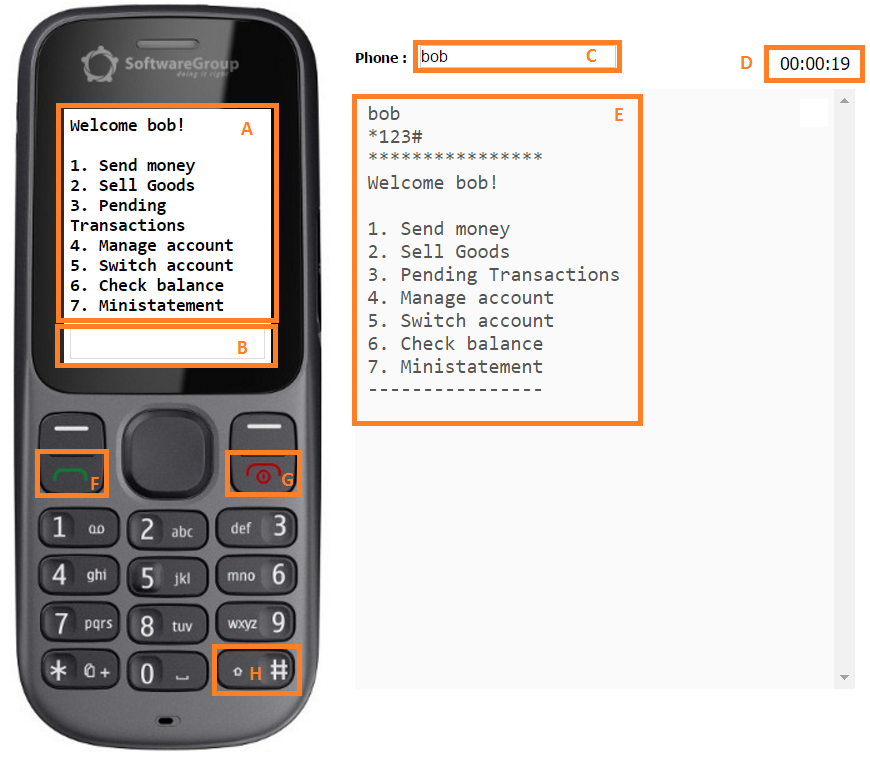

# USSD Simulator User Guide

----------

## 1. Purpose  

The purpose USSD simulator is to simulate a real USSD interface over http protocol. It can send the requests to USSD server and display the responses from it. It is designed as a featured phone on which the user can click on the buttons and see the numbers or text on the screen. Additionally there is a log console where the user can see the requests and responses that have been exchanged with the server. It also has an text box where the user has to enter the phone or user number that the simulator will work with. In the real life scenario this information is coming from the GSM network and passed to the USSD server. The USSD simulator has a timer as well, which can be start and stop and can be used to measure how long a use case or set of actions will take.

## 2. Simulator Functions

Below you can see a screen shot of the emulator with the controls marked with a letter in a rectangle. The explanation of each of those you can find further below. 

**A. Screen where the responses from the USSD server are displayed.** The response usually is limited to maximum 160 character(including spaces and new lines) or in case the USSD text is in Unicode or any other 16 bit encoding, the responses from the server are limited to 80 characters 

**B. Input box for the requests send to the USSD server.** Usually a USSD session is starded by dialing a short code in with a pattern *DDDD#, where D can be any digit from 0 to 9.

**C. Phone or user number of the user currently working with the emulator.** In the real life case this number is coming from the GSM network. In this  box the user can enter also text.

**D. Timer**. The user can start and stop it by clicking on it.

**E. USSD log**. In this box a log for the requests and responses are displayed.

**F. Confirm button.** This button sends the data from box 'B' to the server.

**G. Cancel button.** This button terminates the current USSD session.

**H. Hash button.** Button for switching between numbers and text. To enable the text function you need to click on the button and hold it for 2 seconds.

## 3. Access

The simulator is accessible without credentials on [/ussd](http://ec2-52-37-54-209.us-west-2.compute.amazonaws.com:8019/ussd/ "/ussd") path where dfsp-ussd service is hosted. 

## 4. Use Cases

###1. Customer on-boarding (only for testing purpose)

The use case is developed for testing purposes. It register a user with its account and credentials DFSP Identity, DFSP Subscription, DFSP Account and DFSP ledger services. It also sends register the user into DFSP directory gateway. 

####1.1 To initiate the use case a new user must be entered in the phone input box of the USSD emulator and then select open account option from the menu.
 

####1.2 The user name must be entered on the next screen.

####1.3 The user number must be entered on the next screen

####1.4 The user has to enter an account number

####1.5 The user has to enter his PIN

####1.6 Successful registration screen is displayed

 

----------

###2. Send money from Person To Person 

Send money user case is wire a transfer to another user which can be in different DFSP. When the user number of the receiver is entered, the system display its name. When the amount is entered the system displays the fees that the user which sends the money has to pay. A final confirmation screen is displayed where the user has to enter his PIN.

####2.1 The user case starts by entering an existing user number into the phone box of the simulator and selecting 'Send Money' menu item.

####2.2 On the next screen the user has to enter the destination account number.

####2.3 The system displays the name of the user who is going to receive the money and the currency its account. Then the user has to enter the amount that we wants to send.

####2.4 The system display both local and connector fees and expects the confirmation of the transaction with the user PIN.

####2.5 The system display a final screen with the transaction status, the recipient name, the amount and the currency. The user can go back to the home screen to do another transaction.

----------

###3. Sell Goods

The Sell Goods use case is send an invoice from a merchant to a buyer which can be in different DFSP. When the user number of the receiver is entered, the system display its name. When the amount is entered the system displays the fees that the user which sends the money has to pay. A final confirmation screen is displayed where the user has to enter his PIN.

####3.1 The user case starts by entering an existing user number into the phone box of the simulator and selecting 'Sell Goods' menu item.

####3.2 On the next screen the merchant has to enter the amount of the invoice.

####3.3 The system displays the buyer name and the amount, and expects the confirmation of the invoice with the user PIN. 

---------

###4. Pending Transactions

The Pending Transactions use case is a buyer approving or rejecting a pending invoice from a merchant which can be in different DFSP. When the user number of the receiver is entered, the system display its name. A final confirmation screen is displayed where the user has to enter his PIN.

####4.1 The user case starts by selecting the 'Sell Goods' menu item, and then selecting the pending invoice displayed on the screen.

####4.2 On the next screen the system displays the name of the merchant and the amount of the invoice to be paid. The user has to confirm by entering his PIN, or he can reject by selecting the 'Reject' menu item.

####4.3 A confirmation screen is displayed.

###5. Manage Accounts

The Manage Account USSD menu command enables users to manage their accounts, namely to add, edit, and close an account. They can also get account information.

####5.1 Adding an account

To add an account, the user selects the Add account USSD menu, then enters a name for the new account.

Then the user is prompted to define whether the new account will be a primary one or not. 

The user confirms their choice by entering their PIN, and a confirmation message displays. Next time the user uses the USSD menu, they are prompted to select one of their accounts before proceeding any further.

####5.2 Editing an account

###6. Checking Balance

The Check Balance USSD menu command enables users to check their current balance. 
The user selects the 'Check balance' menu item, and their current balance displays on the screen.

---------

End of document

