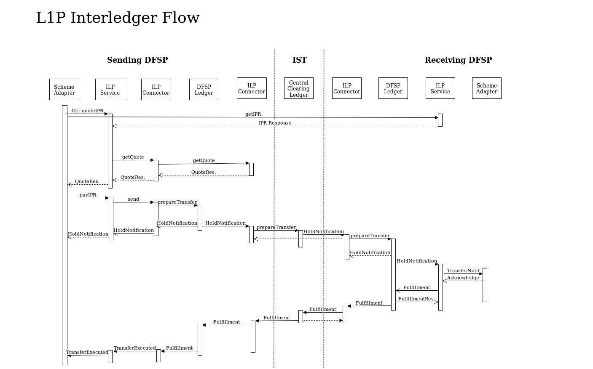

# Interledger Docs
> This folder includes the documentation for the Interledger components

## Running the ILP/SPSP components

[Ansible](https://docs.ansible.com/ansible/playbooks.html) is used for deploying the [`ilp-connector`](https://github.com/interledgerjs/ilp-connector), [`ilp-spsp-client-rest`](https://github.com/LevelOneProject/ilp-spsp-client-rest), and [`ilp-spsp-server`](https://github.com/LevelOneProject/ilp-spsp-server). The [Ansible Playbook](./ansible/ansible.yml) can be run with the command:

```sh
ansible-playbook -v --extra-vars="docker_username=<FILL ME IN> docker_password=<FILL ME IN> docker_email=<FILL ME IN>" --inventory-file=hosts-test ansible.yml
```

This command should be run from the [ansible](./ansible) directory in this repository.

Ansible will use the SSH keys found in your normal SSH directory to log in to the servers.

The Docker credentials are those used for the private registry (modusbox-level1-docker.jfrog.io).

The Inventory File should either be the [hosts-test](./ansible/hosts-test) or [hosts-qa](./ansible/hosts-qa) depending on whether you want to deploy the components to the L1P Test or QA environment.

## ILP Ledger Adapter API

See [ILP Ledger Adapter API](./ledger-adapter.md)

## ILP/SPSP Client REST API

See [SPSP Client REST API](https://github.com/LevelOneProject/ilp-spsp-client-rest)

## ILP Component Architecture


| Component | Function | Interaction w/ Other Components | Owner | Language(s)
|---|---|---|---|---|
| SPSP Client | Main entry point for sending interledger transfers | Query receiving DFSP SPSP Server. Includes ILP Client | Ripple | JS |
| SPSP Server | Generates payment request (ILP Packet) based on SPSP Client query | Responds to SPSP Client query. Includes ILP Client | Ripple | JS |
| ILP Client | Get quotes, send interledger transfers, receive notifications of incoming transfers, fulfill transfer conditions | Included in SPSP Client and Server Get quotes from ILP Connector and authorizes transfers/holds on ILP Ledger Adapter and Central Clearing Ledger | Ripple | JS, later Java |
| ILP Connector | Route interledger payments, respond to quote requests, broadcast rates and routes to other connectors, listen for notifications of incoming transfers, authorize outgoing transfers | Responds to Client quote requests. Listens for notifications from ILP Ledger Adapter and Central Clearing Ledger | Ripple | JS |
| ILP Ledger Adapter | Implement functionality necessary to turn a DFSP's basic ledger into an ILP-compatible one: Crypto Condition validation, transfer holds, notifications | Called by ILP Client and Connectors | ModusBox (with Ripple guidance on API) | Java |
| Central Clearing Ledger | Hold/execute transfers, validate Crypto Conditions, send notifications | Called by ILP Connectors and sends notifications to Connectors | Dwolla | ? |
| DFSP Core System | Already existing accounting system. Implements basic ledger functionality (simple transfers without holds) | Called by ILP Ledger Adapter | Existing / Software Group | ? |

## ILP Flow



Notes:
* Ripple may reimplement the SPSP/ILP Client in Java so that it can run on top of MuleSoft and DFSPs can interact with it using any APIs provided by MuleSoft
* If the DFSP Core Systems are not performant enough, we may need to remove them from the flow of the ILP transfer

Open Questions:

- [ ] Is it okay that SPSP involves one DFSP-to-DFSP request? Can we assume that there is a way for DFSPs to communicate (even if the requests are proxied by the IST)?
- [ ] Which requests should go through a proxy layer (hosted by the DFSP or IST)?

