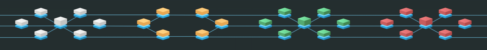
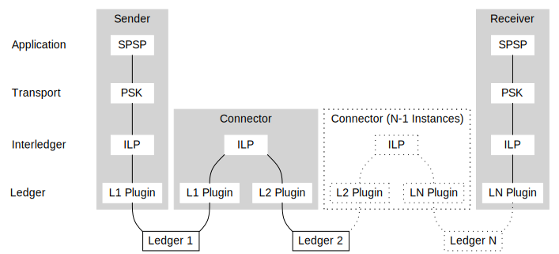

# Primer: Interledger for Level One Project

The Interledger project is a suite of protocol definitions and reference implementations that define a standard way to connect any number of disparate payment systems together into one interconnected network: an _internet of value_. The Level One Project uses Interledger as its settlement layer so that individual instances or deployments of the Level One Project software can eventually become interconnected not just with one another, but with all other payment systems worldwide. Interledger development is spearheaded by Ripple, with support from the W3C and various other stakeholders.

_Interledger provides a standard for linking disparate payment networks to one another._

**Contents:**

- [Why Interledger](#why-interledger)
- [Core Concepts](#core-concepts)
    - [Ledgers](#ledgers)
    - [Connectors](#connectors)
    - [Cryptographic Proof](#cryptographic-proof)
    - [Foward Holds, Backwards Execution](#forward-holds-backwards-execution)
- [Protocol Layers](#protocol-layers)
- [Security](#security)
- [Addresses and Routing](#addresses-and-routing)
- [Data Formats](#data-formats)
- TODO: Software Components?

## Why Interledger

Short answer: Interledger's features and capabilities closely align with the Level One Project's principles, and Interledger is the most advanced standard for interconnectivity at this time.

Long answer: TODO, including content from `Clearing Architecture.md`

    - Push payments
    - Supports central clearing ledger(s) per region
    - Fee transparency(?)

## Core Concepts

### Ledgers

Interledger conceptualizes a _ledger_ as a system tracking accounts and balances in a single currency. In the real world, there are systems called "ledgers" that support multiple currencies; in Interledger parlance, each supported currency in such a system would comprise a separate "ledger". Sending money from one user of a given ledger to another user of the same ledger is called a _transfer_. A payment that can be executed by a single transfer within a single ledger does not need or use Interledger.

### Connectors

The Interledger project assumes that no one ledger will ever serve the whole world. Aside from the problem of scaling a ledger to serve billions of members of humanity, ledgers have different intrinsic qualities that benefit different parties; different ledgers exist today in part because their customers have not just different but _mutually exclusive_ needs and preferences. Still, people would like to be able to pay each other even if they don't use the same ledger:

_Payments that cross a ledger boundary are currently hard._

Rather than trying to create one ledger to rule them all, we should make payment systems **interoperable**. We do this by _connecting_ systems to each other, then bridging payments through multiple connectors using cryptographic proof.

_Connectors link ledgers to each other. In the L1P model, all DFSPs connect to a central ledger._

The _Connector_ is one of the core pieces of ILP software. Each connector is linked to two or more ledgers where it holds a balance, and it facilitates payments by receiving money in one ledger and paying out money in another ledger. Within a single Level One deployment, we expect that each Digital Financial Services Provider (DFSP) runs a connector pairing their home ledger to the central IST ledger, and all the ledgers are denominated in the same currency. In the greater inter-ledger world, a Connector could link two DFSP directly, and the ledgers could be denominated in any pair of currencies; the connector sets the rate of exchange between each ledger's native currency.

### Cryptographic Proof

Without Interledger, each link in a chain needs to be trustworthy, and increases the risk of a transaction failing partway through. Interledger solves this problem with the financial equivalent of a [two-phase commit](https://en.wikipedia.org/wiki/Two-phase_commit_protocol). Each transfer in the payment is locked by a _condition_ value and unlocked by a _fulfillment_ value that hashes to the condition.

TODO: ledger support considerations link, diagram?

### Forward Holds, Backwards Execution

TODO. optimistic transfers discussion & diagram, ILP forward holds, backwards execution. Discussion of expirations/timeouts and possible failures?

## Protocol Layers

The design of Interledger intentionally copies the design of the Internet as much as is applicable. The four Interledger layers—Ledger, Interledger, Transport, and Application—are analogous to the Data link, Network, Transport, and Application layers of the [OSI model](https://en.wikipedia.org/wiki/OSI_model). Both models revolve around a single core protocol: Internet Protocol (IP) for the OSI stack, and the Interledger Protocol (ILP) for the Interledger stack.

| Internet Stack | ILP Stack |
|----------------|-----------|
|  |  |

Another way of looking at the protocol:

TODO: additional discussion of the W diagram

### Application Layer

The Application Layer coordinates and prepares transfers. User-facing applications implement protocols from this layer to prepare payments with one another. The Level One Project uses [SPSP v2][] as an application layer protocol. In SPSP, the sender and receiver each have a client application, which communicate directly via HTTPS, to plan a payment before preparing it in the transport layer.

[SPSP v2]: https://github.com/interledger/rfcs/blob/master/0009-simple-payment-setup-protocol/0009-simple-payment-setup-protocol.md

### Transport Layer

The Transport Layer defines how payments are identified and how to generate the cryptographic conditions for the transfers in the payment. The Level One Project uses the Interledger Payment Request (IPR) format. For the data included in this layer, the Level One Project uses the format defined by the Interledger Pre-Shared Key (PSK) specification, which resembles HTTP headers, although L1P does not use the PSK protocol itself.

Key pieces of data that are defined in this level are:

- The expiration time of the payment
- The key type used to generate the unique condition and fulfillment for this payment
- A unique nonce for the payment
- The Level One Project "Trace ID" of a payment

Further reading:

- [IL-RFC-11: Interledger Payment Request](https://github.com/interledger/rfcs/blob/master/0011-interledger-payment-request/0011-interledger-payment-request.md): The IPR specification
- [IL-RFC-16: Pre-Shared Key](https://github.com/interledger/rfcs/blob/master/0016-pre-shared-key/0016-pre-shared-key.md): The PSK specification, which includes the data format recommended for use with IPR

### Interledger Layer

There are two closely-related protocols in the Interledger layer: the Interledger Protocol (ILP) and the Interledger Quoting Protocol (ILQP). Connectors communicate to each other in these protocols, using ILQP to quote payments and ILP to prepare payments. (The execution happens individually for each transfer at the ledger layer.)

TODO: more?

Further reading:

- [IL-RFC-3: Interledger Protocol](https://github.com/interledger/rfcs/blob/master/0003-interledger-protocol/0003-interledger-protocol.md)
- [IL-RFC-8: Interledger Quoting Protocol](https://github.com/interledger/rfcs/tree/master/0008-interledger-quoting-protocol)

### Ledger Layer

The ledger layer is implemented by the unique, core ledgers of each system. In the Level One Project, these ledgers include each DFSP's internal ledger and the IST's central ledger.

Ledgers must have certain features for

Each Connector must know how to use the API of the ledgers to which it is connected. Rather than having a unique API for each ledger, the Level One Project's reference implementations all use a consistent API, called the [Five Bells Ledger API][]. In the case of a DFSP that has an existing ledger API, either the DFSP must run an adapter to provide a Five Bells Ledger API, or the Connector must have a plugin for using the DFSP's own ledger API.

[Five Bells Ledger API]: TODO: proper IL-RFC link for this

## Security

TODO

## Addresses and Routing

Within the Interledger Protocol (ILP) layer, connectors route payments according to their internal routing tables. The destination of a given ILP payment is determined by its ILP Address, a hierarchical string of alphanumeric identifiers analogous to an IP address.

In the Level One Project, connectors use static routing tables to determine where to route payments. For example, all payments to addresses starting with `private.l1p.demo-instance.blue-dfsp.` are routed to the connector operated by Blue DFSP. (TODO: maybe change the example address)

ILP Addresses are specified by [IL-RFC-15: ILP Addresses](https://github.com/interledger/rfcs/blob/master/0015-ilp-addresses/0015-ilp-addresses.md).

## Data Formats

TODO: discussion of why we use ASN.1 to specify binary formats for most things?

### PSK Data Format
TODO: (used even when using IPR instead of PSK)

### ILP Packet

TODO: binary format as defined here. https://github.com/interledger/rfcs/blob/master/0003-interledger-protocol/0003-interledger-protocol.md#ilp-payment-packet-format

### ILP Error Format

TODO: as defined here https://github.com/interledger/rfcs/blob/master/0003-interledger-protocol/0003-interledger-protocol.md#ilp-error-format

JSON equivalent? Conversion from JSON to the ILP binary format?

### Amounts

TODO

64-bit UInts: scale and currency defined by ledger and advertised in the 5BL API "Metadata" method

Strings in JSON so as not to lose precision
