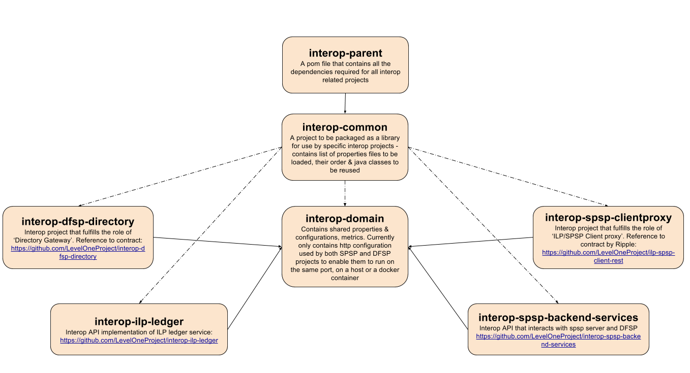

# Interop Services

The various interop service APIs act as proxies and/or provide features such as validation, authentication and data transformation where necessary. The services operate based on service specifications provided in both Open API and RAML. The services run on Mule community runtime. There are four interop micro-services (recently two of them: interop-spsp-clientproxy and interop-spsp-backend-services are merged into one interop-scheme-adapter, so total of three services) that are mentioned below and several supporting projects.

There are several repositories that support non-functional requitements such as Performance, Logging, Metrics and Deployment that are discussed below as well.

Contents:

* [Overview](#overview)
* [Architecture](#architecture)
* [Interfaces](#interfaces)
* [Testing](#testing)
* [Security](#security)
* [Resilience](#resilience)
* [Performance](#performance)
* [Logging](#logging)
* [Deployment](#deployment)

## Overview
Component Diagram

## Architecture
User Message/Flow Diagram

The diagram in this section show the positive or “happy” path of the user. Negative and boundary cases are described in other specifications. A data flow diagram is also used for threat modeling.

### Interfaces
- **interop-dfsp-directory** - This project provides an API gateway to the IST Directory Naming Service and provides resources to - "get metadata about a directory", "get customer information by providing identifier, identifierType", "Register a DFSP" and "get identifierTypes supported by the central directory"
    - [Spec](https://github.com/LevelOneProject/interop-dfsp-directory/blob/master/README.md) | [Code](https://github.com/LevelOneProject/interop-dfsp-directory)
- **interop-spsp-clientproxy** - This interop project fulfills the role of ilp-spsp-client proxy. This project provides an API gateway to the ilp-spsp-client Service. It supports methods to query, quoteSourceAmount, setup and payment request as specified. This is now **deprecated** and its functionality is covered by interop-scheme-adapter.
    - [Spec](https://github.com/LevelOneProject/interop-spsp-clientproxy/blob/master/README.md) | [Code](https://github.com/LevelOneProject/interop-spsp-clientproxy)
- **interop-spsp-backend-services** - This project provides an interop API implementation that interacts with SPSP server and DFSP. Implementation of SPSP Backend server is based on ilp-spsp-server specified [here](https://github.com/LevelOneProject/ilp-spsp-server). This is now **deprecated** and its functionality is covered by interop-scheme-adapter.
    - [Spec](https://github.com/LevelOneProject/interop-spsp-backend-services/blob/master/README.md) | [Code](https://github.com/LevelOneProject/interop-spsp-backend-services)
- **interop-ilp-ledger** - This project provides an interop API implementation of ILP Ledger Service.
    - [Spec](https://github.com/LevelOneProject/interop-ilp-ledger/blob/master/README.md) | [Code](https://github.com/LevelOneProject/interop-ilp-ledger)
- **interop-scheme-adapter** - This project provides an API gateway to the ilp-service microservice. It supports methods to query, quote,payment request as specified in the [ilp-service](https://github.com/LevelOneProject/ilp-service).
    - [Spec](https://github.com/LevelOneProject/interop-scheme-adapter/blob/master/README.md) | [Code](https://github.com/LevelOneProject/interop-scheme-adapter)

#### Supporting projects for functionality
* [interop-parent](https://github.com/LevelOneProject/interop-parent)
* [interop-common](https://github.com/LevelOneProject/interop-common)
* [interop-domain](https://github.com/LevelOneProject/interop-domain)

#### Projects for non-functional requirements
* [interop-docker](https://github.com/LevelOneProject/interop-docker)
* [interop-devops](https://github.com/LevelOneProject/interop-devops)
* [interop-metrics-ui](https://github.com/LevelOneProject/interop-metrics-ui)
* [interop-mule-connector-metrics](https://github.com/LevelOneProject/interop-mule-connector-metrics)
* [interop-functional-tests](https://github.com/LevelOneProject/interop-functional-tests)
* [interop-performance](https://github.com/LevelOneProject/interop-performance)
* [interop-elk](https://github.com/LevelOneProject/interop-elk)
* [interop-metrics-server](https://github.com/LevelOneProject/interop-metrics-server)

## Testing
Test Strategy

Java Unit Tests exist for each of the projects for unit testing, some of which use WireMock framework. Tests are run as part of executing the Maven pom.xml as mvn clean package.

Along with these unit tests, additional tests can be run by using the tests present in [interop-performance](https://github.com/LevelOneProject/interop-performance/tree/master/JMeter) which include several functional and scenario tests. These include USSD tests as well as JMeter scripts that can be used for performance/load testing and cover end-to-end scenarios.

## Security

Security/Threat Model for L1P Reference Implementation is [here](https://www.dropbox.com/home/Level%20One%20OSS%20Team%20Share/Discussion%20Docs?preview=ThreatModel_LevelOneProject.docx)

## Resilience

Resilience model for L1P Reference Implementation is [here](https://www.dropbox.com/home/Level%20One%20OSS%20Team%20Share/Discussion%20Docs/Non%20Functional%20Requirements?preview=rmaworkbook+with+Fixes.xlsx)

## Performance

Performance approach for Interop services and for L1P project as a whole is described [here](./L1P%20Performance%20Test.md). Tools used and ways to perform analysis are also described. This can be used for use case or scenario tests as well as isolated testing of services using mocks. The same approach and scripts can be used for Load Testing as well.

## Logging

Logging guidelines for L1P project were drafed and after review by partner teams, documented [here](./logging-guidelines.md). Aspects of end-to-end Tracing and support for Metrics are discussed and requirements described in the guidlines document. The configuration used and other customizations such as adding indexes can be found in the [interop-elk](https://github.com/LevelOneProject/interop-elk) project.

## Deployment

The L1P system can be deployed using Vagrant and Ansible playbooks to create two DFSPs and one CST VMs with support for MGMT VMs to allow execution on all supported platforms, including windows. The user guide for this is [here](https://github.com/LevelOneProject/interop-devops/blob/master/USERGUIDE.md)