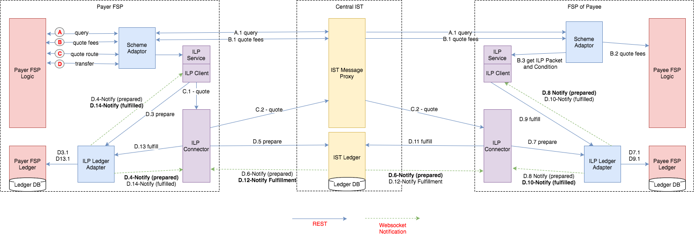

# Send Money
See [Scenario definition](https://github.com/LevelOneProject/Docs/blob/master/scenarios.md#send-money-to-anyone) for what this scenario should accomplish.

To connect to working API definitions use the [DFSP Ports guide](../../DFSP#default-ports), [Level One Client Ports guide](../Ports.md), and Central Directory Ports Guide.

## Message Flow and Overview

This diagram shows the order of the calls.

Calls are made from A through C, and within each letter they increment by number. Example: C.1, C.2, C.3, etc.

The 3 ledgers send notifications of each transaction to all subscribers, so, for example, following C.1 there are two C.2 notifications. One goes back to the ILP client and tells it that the ledger got the message the ILP client just sent. The second more important notification goes on to the ILP Connector, which in turn calls C.3 .

## A - Lookup/Discovery
The first stage of any transfer is to find out what institution can accept money for this user number. The DFSP calls the Central Directory through the DSFP Directory Gateway.

[Discovery Documented](https://github.com/LevelOneProject/Docs/blob/ccf08b20affc06bde8f587446fa0abf1975f3999/Discovery.md)

[Central Directory Lookup API](https://github.com/LevelOneProject/central-directory/blob/master/central-directory-documentation.md)

[DFSP Implementation](http://ec2-35-166-189-14.us-west-2.compute.amazonaws.com:8011/documentation) DFSP:8011/documentation

[Level One Client Proxy API Implementation](http://ec2-35-166-189-14.us-west-2.compute.amazonaws.com:8081/directory/v1/console/) DFSP:8081/directory/v1/console/

    Post :user/get
    Post: user/add # Expect to change

> ***OUT OF DATE STARTS HERE***

## B - Query & Quote
The 2nd, quoting, stage of the transfer is to negotiate the transfer contract. This means agreeing on the currency, fees, time frame, exchange rate, etc. The query asks "Can the transaction go through for this person and amount". The quote sets the contract including fees, rates, etc.

The [query](https://github.com/LevelOneProject/ilp-spsp-client-rest#get-v1query) gets the user information and currency information. The [quote](https://github.com/LevelOneProject/ilp-spsp-client-rest#get-v1quotesourceamount) is an optional setup to get the fees ahead of setup.

### SPSP Client Proxy
The [Interop Client Proxy](https://github.com/LevelOneProject/interop-spsp-clientproxy) is a pass through to the [SPSP client rest API](https://github.com/LevelOneProject/ilp-spsp-client-rest/blob/master/README.md)

[SPSP Client Proxy Implemented](http://ec2-35-166-189-14.us-west-2.compute.amazonaws.com:8081/spsp/client/v1/console/) DFSP:

    GET:  /query - get the information about the account based on customer URI
    GET:  /quoteDestinationAmount - get the fee for the connectors
    (assume that receiving DFSP will not be able to add a fee to the sender)
    POST:  /setup - setup a payment contract

    Not part of scenario
    GET: /quoteSourceAmount - returns a single amount that the sender would get

### SPSP Server
The [SPSP Server proxy](https://github.com/LevelOneProject/interop-spsp-backend-services) is a pass through to the [SPSP Server API](https://github.com/LevelOneProject/ilp-spsp-server)

[SPSP API Implemented](http://ec2-35-166-189-14.us-west-2.compute.amazonaws.com:8081/spsp/backend/v1/console/)

    GET: /receivers/{payee}   
    PUT: /receivers/{payee}/payments/{uuid}  

> ***OUT OF DATE ENDS HERE***

### DFSP
For the DFSP the quoting APIs start in [The DFSP ledger service](./DFSP) which talk to the SPSP Client proxy.

[DSFP Ledger API Implemented](http://ec2-35-166-189-14.us-west-2.compute.amazonaws.com:8014/documentation#/)

    GET /ledger/transfers/{id} -  Get Transfer by ID  
    PUT /ledger/transfers/{id}  - Prepare/Propose transfer

## C - Prepare and Fulfill
The final portion begins with a message to send the money from the source DFSP to the ILP Ledger Adapter (not shown).

[ILP Client Ledger Adapter Documented](./ILP/ledger-adapter.md)

[ILP Ledger Adapter APIs (Implemented)](http://ec2-35-166-189-14.us-west-2.compute.amazonaws.com:8081/ilp/ledger/v1/console/)

    GET: /   
    GET: /accounts   
    GET/PUT: /accounts/{id}   
    GET/PUT: /transfers/{id}   
    PUT: /transfers/{id}/fulfillment   
    GET: /connectors   

> ***OUT OF DATE STARTS HERE***

### SPSP Client Proxy PAYMENT
    PUT:  /payments/{id} - execute a payment
    assuming a synchronous pass/fail response for the payment status
> ***OUT OF DATE ENDS HERE***

The receiving DFSP has to validate that it will accept the transfer (skipped for now) and fulfill it.
### DFSP

[DFSP API](http://ec2-35-166-189-14.us-west-2.compute.amazonaws.com:8014/documentation#/)

    GET: /ledger/transfers/{id}/fulfillment Get Transfer Fulfillment   
    PUT: /ledger/transfers/{transferId}/fulfillment Execute prepared transfer

## Setup
Before the transfer can happen, the ILP components need to subscribe to notifications from the ledgers. This is done when the components start up, however, if it was not setup, this message would make sure it was.

There are 3 ledgers: the source DFSP, central ledger, and destination DFSP. Each must be updated during the transfer.

[SPSP Ledger Adapter subscriptions](./ILP/ledger-adapter.md#subscribe-to-account-transfers)

     Ledger: SubscribeAccountTransfers  
     ws://<host>/accounts/:name/transfers  
