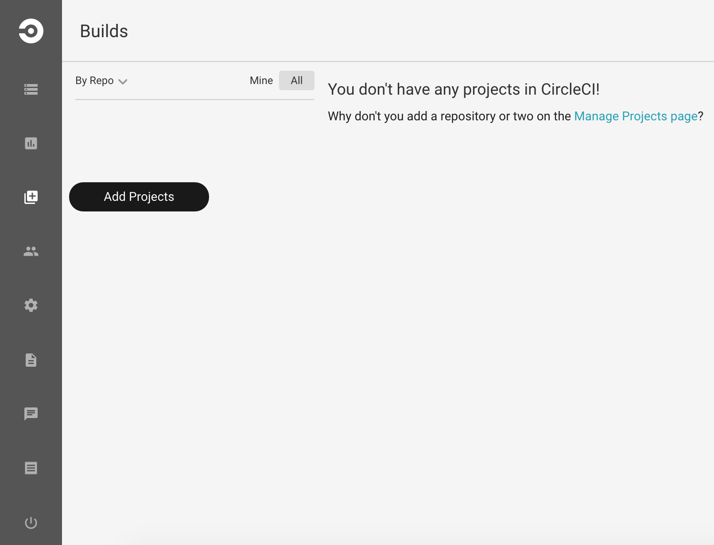
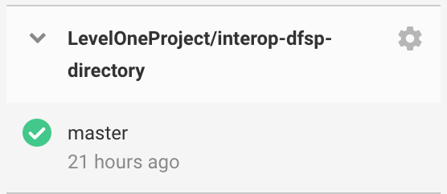
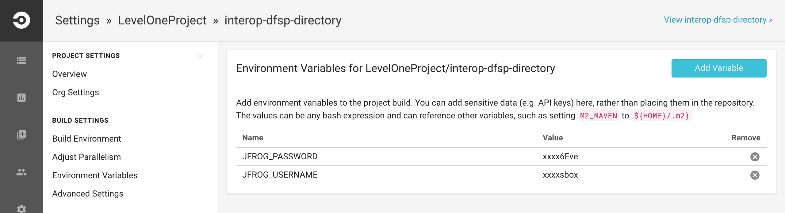

# Including a new project in CircleCI #

## Create circle.yml file ##

CircleCI uses a file called “circle.yml” in every project in order to know how to work with it. Add a new file into the root folder of the project and name it "circle.yml", then copy the following content into it.

```yml
---
checkout:
  pre:
    - curl -H "Authorization:token $GITHUB_TOKEN" -H 'Accept:application/vnd.github.v3.raw' -o /tmp/interop_maven_settings.xml -L https://raw.githubusercontent.com/LevelOneProject/automation/master/interop/interop_maven_settings.xml
dependencies:
  override:
    - "mvn dependency:resolve -s /tmp/interop_maven_settings.xml"

test:
  override:
    - "mvn integration-test -s /tmp/interop_maven_settings.xml"
  post:
    - mkdir -p $CIRCLE_TEST_REPORTS/junit/
    - find . -type f -regex ".*/target/surefire-reports/.*xml" -exec cp {} $CIRCLE_TEST_REPORTS/junit/ \;

deployment:
  releases:
    branch: master
    commands:
      - git config --global user.email "info@modusbox.com"
      - git config --global user.name "Automatic Deployment via CircleCI"
      - mvn -B release:prepare -Darguments="-DskipTests" -DscmCommentPrefix="[maven-release-plugin][ci skip]" -s /tmp/interop_maven_settings.xml
      - mvn -B release:perform -Darguments="-DskipTests" -s /tmp/interop_maven_settings.xml

      - git remote set-url origin https://$GITHUB_TOKEN@github.com/LevelOneProject/interop-xxxxxxxxx.git
      - git checkout -B develop origin/develop
      - git pull origin develop
      - git merge master
      - git push origin develop
```

You need to modify the deployment section modifying the git remot set-url command to point to the right URL. 

In case the project has no tests, you should modify this file by removing the test section and pasting the one included bellow n the TEST section.

## What is this circle.yml file doing? ##

### Checkout ###
In this section and before the code is pulled from github, a settings file for maven gets downloaded. This file is located in a github repository called automation and has the information to authenticate to Artifactory and Github. 

### Dependencies ###
Maven dependencies are retrieved using maven, this section is run before to speed up future builds by saving dependencies in a cache.

### Test ###
Almost all the projects has tests to run, but there are two exceptions: interop-domain and interop-parent. In those cases the test section is overriden with a message.

```yml
test:
  override:
    - echo "This project test section has been overriden on the circle.yml file"
```

In those projects with tests to run, after the execution is completed a new folder is created and the test results are copied. By doing that CIRCLECI knows how many tests were run and which were the results.

### Deployment ###
This section runs only for master branch. First we set both the username and the email, these are set so we can identify that those commits were made by CircleCI.

Maven release plugin is used by both the prepare and release command, the tests are skipped to reduce the build time. 

Then the last lines are git commands that merges the version number changes back into develop branch.


## Configuring the project in CircleCI for the first time ##

### Configure github and Jfrog  ###

Login into CircleCI and go to https://circleci.com/dashboard. There is a menu on your left, click on the third option ("Add Projects")



In the following screen you should choose the project you want to add from the list, clicking on the button on its right. In case there is no button on the project and you get a "Contact repo admin" message, you need to ask for administrative privileges in order to continue adding it. In case the project is already configured then the button is "Follow Repo", in which case the following steps were already done.


### Setting the environment variables ###


In case the project wasn't configured before, you need to add the environment variables. The maven settings file includes credentials that needs to be set as environment variables. The following is a code snippet that shows how the settings file is configured:

```xml
<servers>
  <server>
     <id>git</id>  
     <username>${env.GITHUB_USER}</username>  
     <password>${env.GITHUB_TOKEN}</password>  
  </server> 
  <server>
    <username>${env.JFROG_USERNAME}</username>
    <password>${env.JFROG_PASSWORD}</password>
    <id>modusbox-release-local</id>
  </server>
  <server>
    <username>${env.JFROG_USERNAME}</username>
    <password>${env.JFROG_PASSWORD}</password>
    <id>modusbox-snapshot-local</id>
  </server>
</servers>
```


In order to add the variables go to the settings page of the project by clicking on the gear button next to the project title.



On the left side of the screen there is a submenu, click on the menu item called "Environment Variables" which is below the title "Build Settings". Once in there, you need to add the variables: JFROG_USERNAME, JFROG_PASSWORD, GITHUB_USER and GITHUB_TOKEN. In case you dont know the right values please contact someone from modusbox team.



When you added the project for the first time the project build should have failed because there were no credentials provided in the environment variables. Once you finished the configuration get back to the dashboard and click on Rebuild so it can build the project again.


