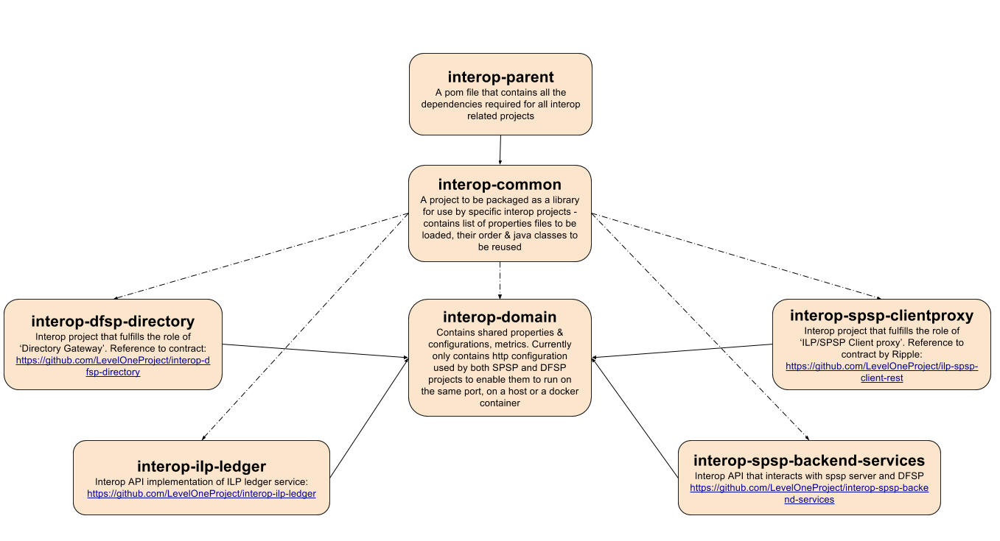

# Interop services overview (Mule components)

The various interop service APIs act as proxies and/or providing features such as validation, authentication and data transformation where necessary. The services operate based on service specifications provided in both Open API and RAML. The services run on Mule community run time. There are four interop micro services that are mentioned below and several supporting projects.

Contents:

[Component Diagram] (#component diagram)
[User Message/Flow Diagrams] (#user message/flow diagrams)
[Interfaces] (#interfaces)
[Test Strategy] (#test strategy)
[Security/Treat Model] (#Security/Threat Model)
[Resilience Model] (#Resilience Model)
[Monitoring/Health Model] (#Monitoring/Health Model)

## Component Diagram

## User Message/Flow Diagrams

(This set of diagrams shows the positive or “happy” path of the user. Negative and boundary cases are described. A data flow diagram is also used for threat modeling (see below).)

## Interfaces
- **interop-dfsp-directory** - This project provides an API gateway to the IST Directory Naming Service and provides resources to - "get metadata about a directory", "get customer information by providing identifier, identifierType", "Register a DFSP" and "get identifierTypes supported by the central directory"
    - [Spec](https://github.com/LevelOneProject/interop-dfsp-directory/blob/master/README.md) | [Code](https://github.com/LevelOneProject/interop-dfsp-directory)
- **interop-spsp-clientproxy** - This interop project fulfills the role of ilp-spsp-client proxy. This project provides an API gateway to the ilp-spsp-client Service. It supports methods to query, quoteSourceAmount, setup and payment request as specified.
    - [Spec](https://github.com/LevelOneProject/interop-spsp-clientproxy/blob/master/README.md) | [Code](https://github.com/LevelOneProject/interop-spsp-clientproxy)
- **interop-spsp-backend-services** - This project provides an interop API implementation that interacts with SPSP server and DFSP. Implementation of SPSP Backend server is based on ilp-spsp-server specified [here](https://github.com/LevelOneProject/ilp-spsp-server)
    - [Spec](https://github.com/LevelOneProject/interop-spsp-backend-services/blob/master/README.md) | [Code](https://github.com/LevelOneProject/interop-spsp-backend-services)
- **interop-ilp-ledger** - This project provides an interop API implementation of ILP Ledger Service.
    - [Spec](https://github.com/LevelOneProject/interop-ilp-ledger/blob/master/README.md) | [Code](https://github.com/LevelOneProject/interop-ilp-ledger)

#### Supporting projects
* [interop-parent](https://github.com/LevelOneProject/interop-parent)
* [interop-common](https://github.com/LevelOneProject/interop-common)
* [interop-domain](https://github.com/LevelOneProject/interop-domain)
* [interop-docker](https://github.com/LevelOneProject/interop-docker)
* [interop-devops](https://github.com/LevelOneProject/interop-devops)
* [interop-metrics-ui](https://github.com/LevelOneProject/interop-metrics-ui)
* [interop-mule-connector-metrics](https://github.com/LevelOneProject/interop-mule-connector-metrics)
* [interop-functional-tests](https://github.com/LevelOneProject/interop-functional-tests)

## Test Strategy

Java Unit Test exist for each of the projects for unit testing. Tests are run as part of executing the Maven pom.xml as mvn clean package.

Along with these unit tests, additional tests can be run by using the tests present in [interop-functional-tests](https://github.com/LevelOneProject/interop-functional-tests) which include several functional and scenario tests. These include USSD tests as well as JMeter scripts that can be used for load testing and cover end-to-end scenarios.

## Security/Threat Model

Security/Threat Model for L1P team [here](https://www.dropbox.com/home/Level%20One%20OSS%20Team%20Share/Discussion%20Docs?preview=ThreatModel_LevelOneProject.docx)

## Resilience Model

Resilience model for L1P [here](https://www.dropbox.com/home/Level%20One%20OSS%20Team%20Share/Discussion%20Docs/Non%20Functional%20Requirements?preview=rmaworkbook+with+Fixes.xlsx)

## Health Model

Health model might be merged with Resilience model described above or when this has its own document, will update it here.