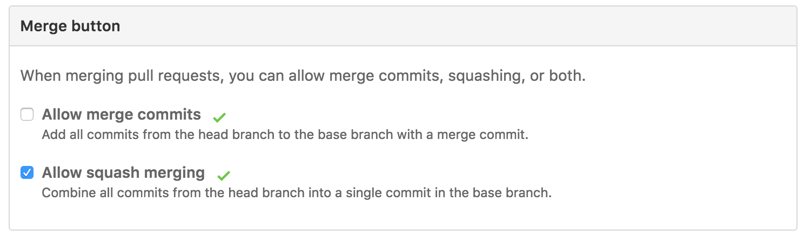
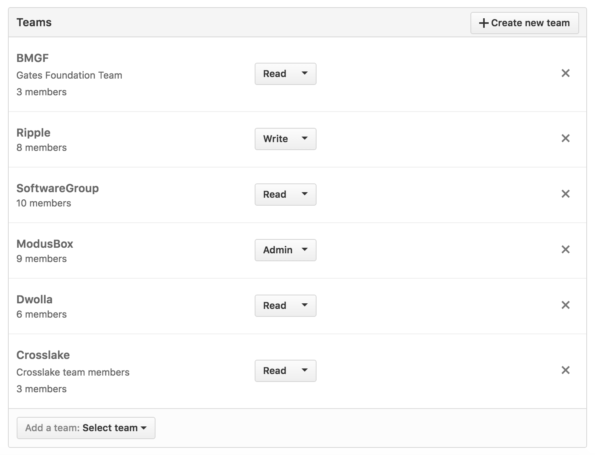

## New Repository tasks ##

### Branches ###

Create a new branch named "develop". In this branch the development is done and merged to master everytime the code is ready to integrate with the rest of the components.

### Merge ###

In github repository settings tab, scroll down to the groupbox named "Merge Button" and untick the option "Allow merge commits".

### Access ###

On the left side of the screen click on the submenu item named "Collaborators & Teams", scroll down to the team groupbox and copy the permissions shown on the following image.

### CircleCI configuration ###

Follow these instructions 
https://github.com/LevelOneProject/Docs/blob/master/mule/CircleCI/CircleCI.md
